# Add Customer

This procedure explains how to add new customers, update their contact information, and create alternate shipping addresses within the system.

## Create New Customer

> [!TIP]
> Always prioritize adding customers through the quick entry form available in other documents rather than creating a customer from scratch from the customer list.

### Step 1: Access Quick Entry Form
Open a new document (e.g., Quotation or Sales Order), click the **Customer** dropdown, and select **+ Create a new Customer**.

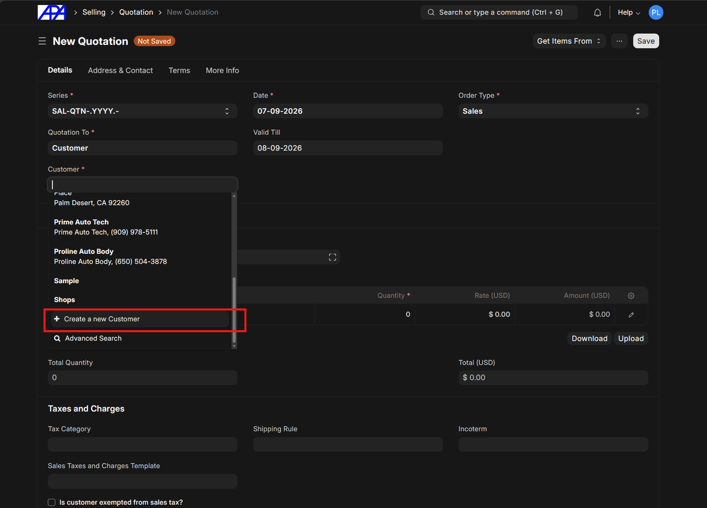

### Step 2: Fill Out Customer Form
Complete the **New Customer** form, filling in the Customer Name, Customer Type, Primary Contact Details, and Primary Address Details. Click **Save** when finished.

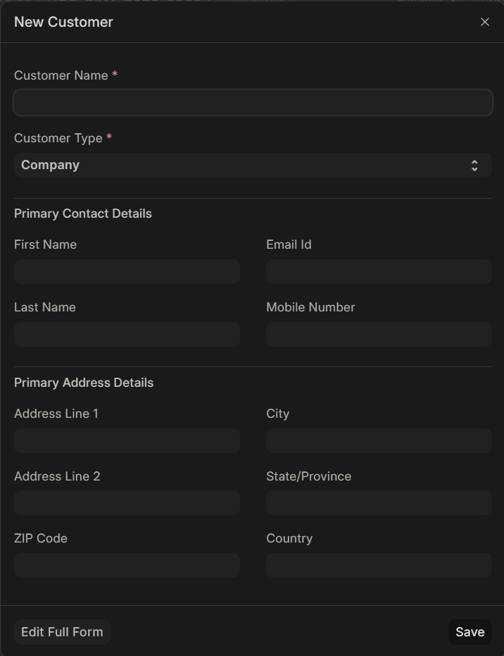

> [!IMPORTANT]
> Ensure all fields are filled and avoid leaving blank fields. If certain information is not available, wait until that information becomes available before completing the form. Do not create a customer with only partial information.
> 
> Complete information ensures future communication from within the system works correctly. It is very difficult to add contact or address information after the fact.
>
> Below are picture of some systems that rely on this entry.

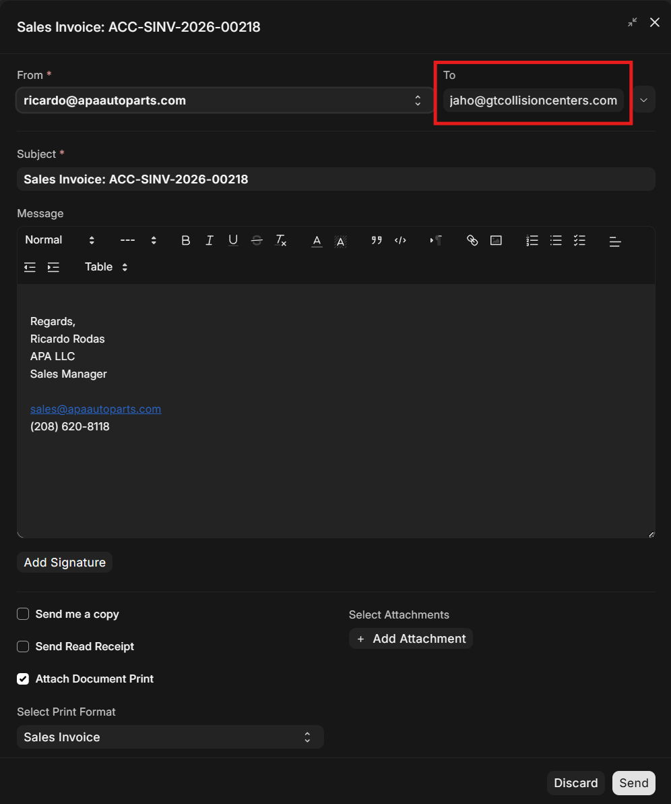
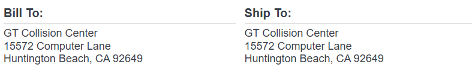

---

## Update Customer Contact Information

Use this procedure to add contact or address information if it was not available at the time of creation.

### Step 1: Open Customer Profile
From an existing document, click the arrow (`->`) next to the **Customer** field to open the customer detail page.

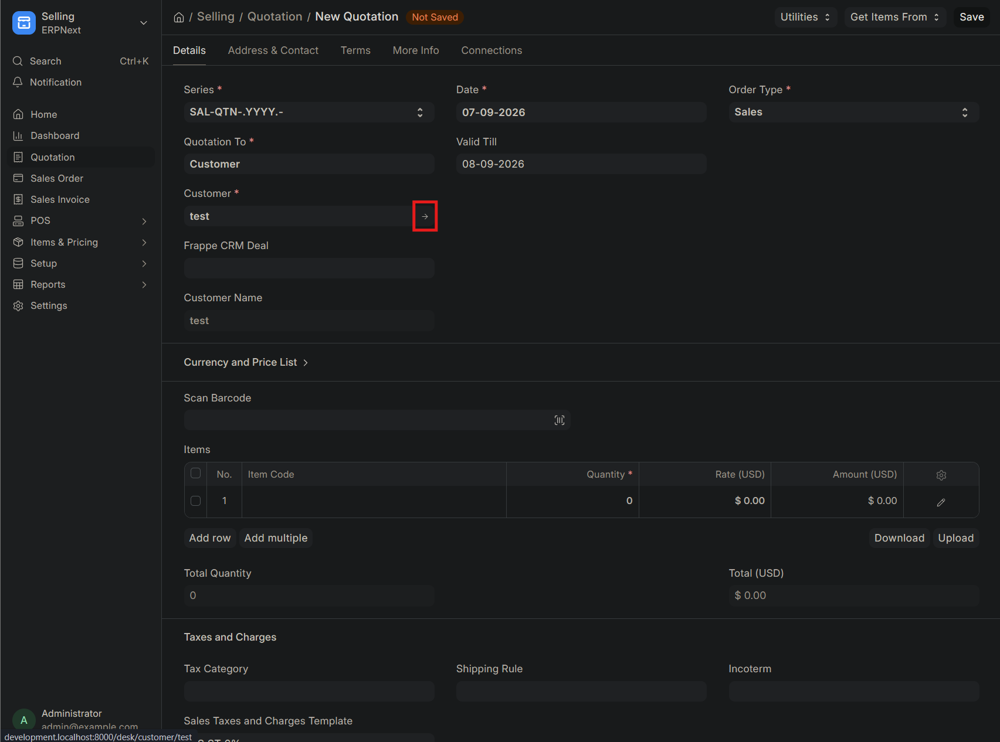

### Step 2: Add New Contact
Navigate to the **Address & Contact** tab and click **New Contact**.

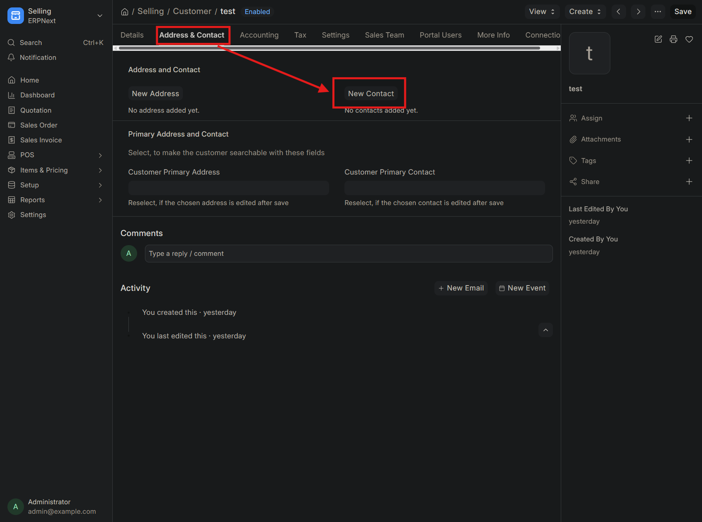

### Step 3: Configure Contact Details
Fill in the contact information. Ensure you check the boxes for **Is Primary** (for email) and **Is Primary Phone** / **Is Primary Mobile** as applicable.

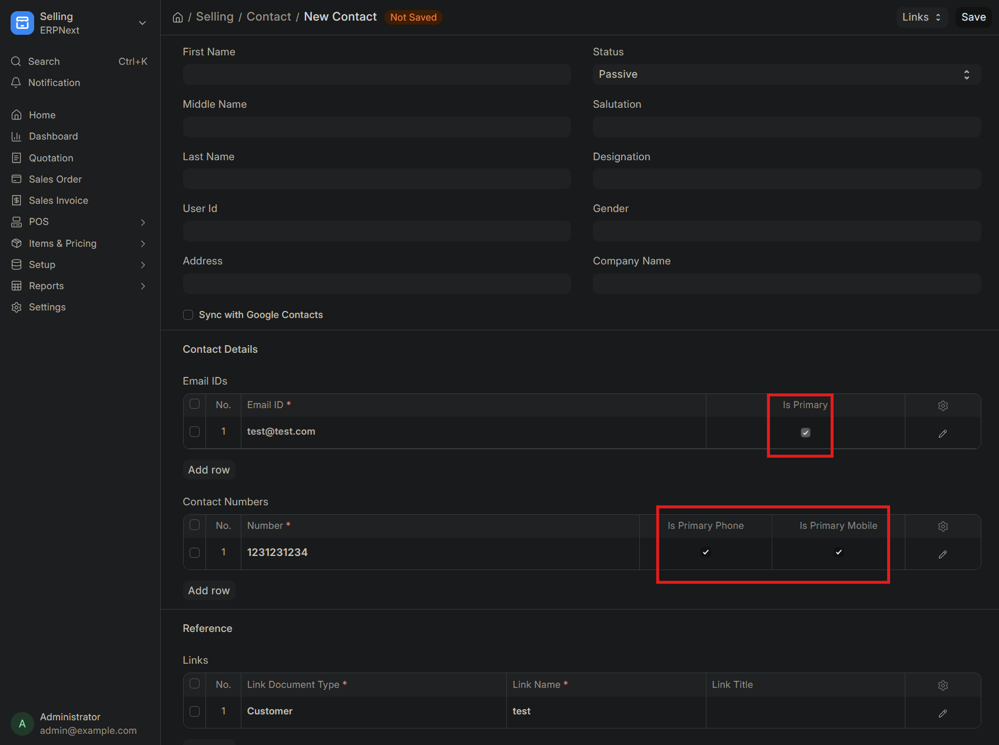

### Step 4: Save Contact
Click **Save**. The new contact will now appear under the customer's profile.

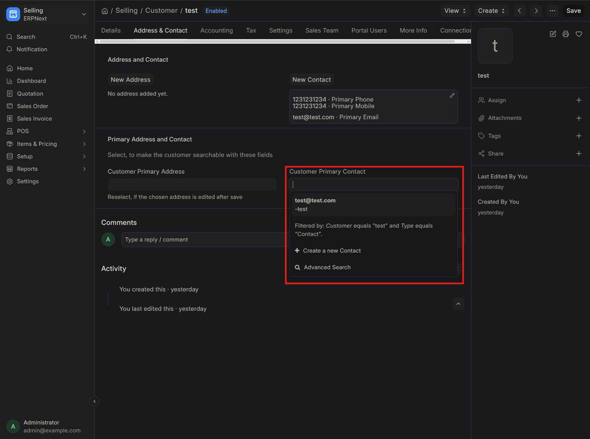

> [!NOTE]
> Newly added contact information will only be available in newly created documents. Existing documents do not automatically update and will retain the previous information.

**Comparison:**

| Existing Documents (Old Information) | Newly Created Documents (New Information) |
|:---:|:---:|
| 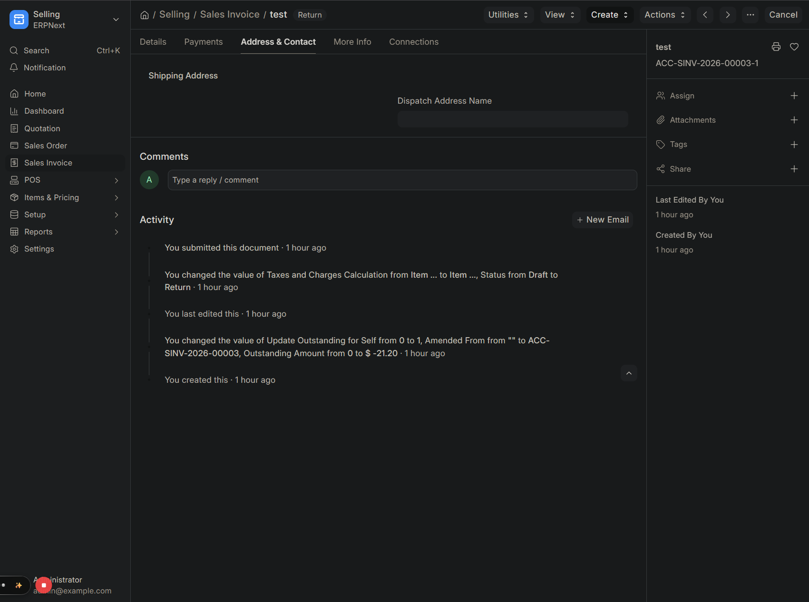 | 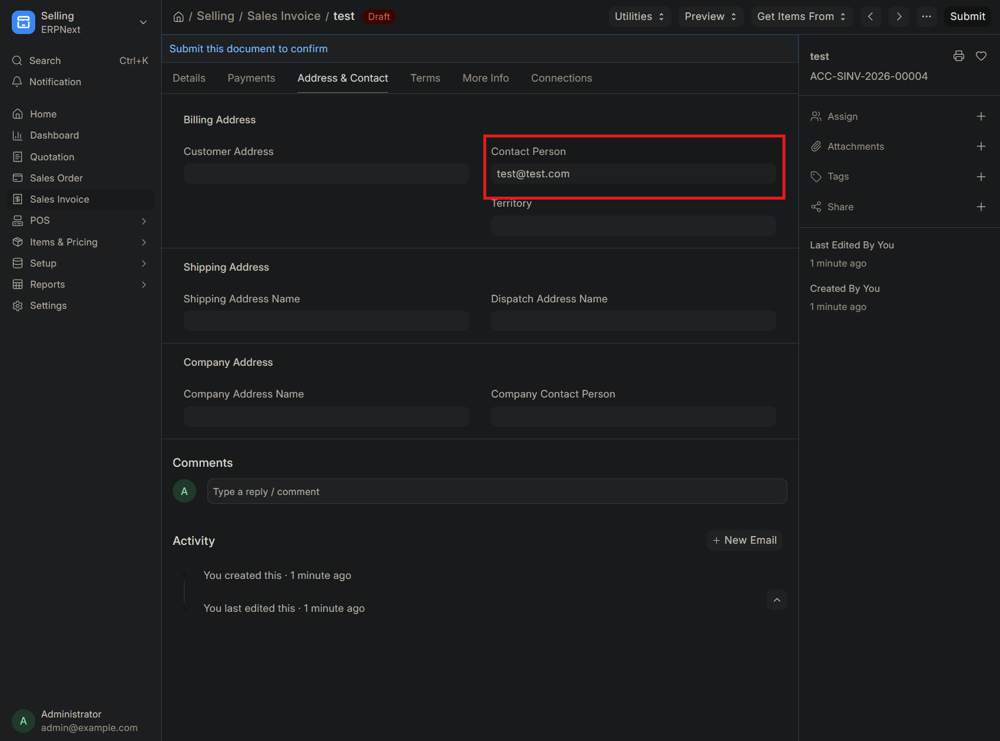 |

---

## Add Alternate Shipping Address

Follow these steps when a customer requests a shipping address that differs from their billing address.

### Step 1: Create New Address
Within a document (such as a Sales Invoice), navigate to the **Address & Contact** tab. Open the **Shipping Address Name** dropdown and click **+ Create a new Address**.

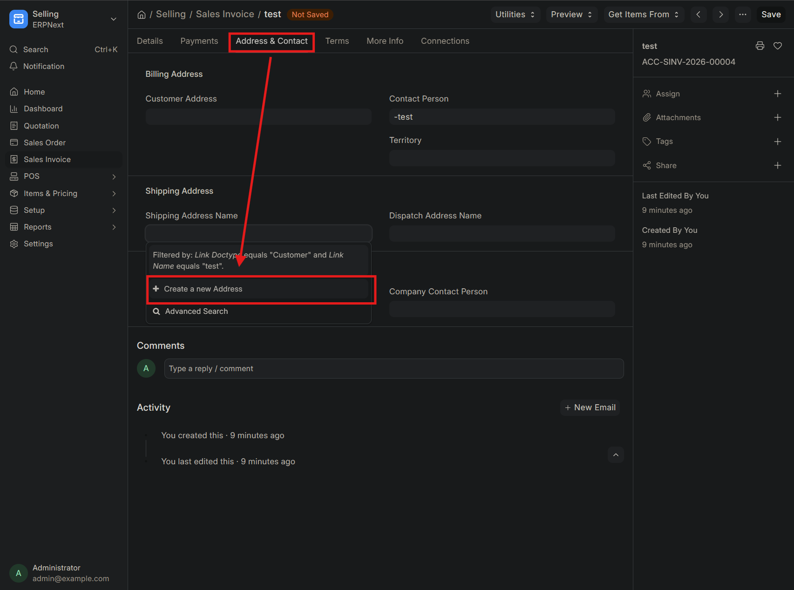

### Step 2: Configure Shipping Address
In the new address form, set the **Address Type** to **Shipping** and check the **Preferred Shipping Address** box.

> [!CAUTION]
> Do not fill in the Email Address and Phone fields for an alternate shipping address.

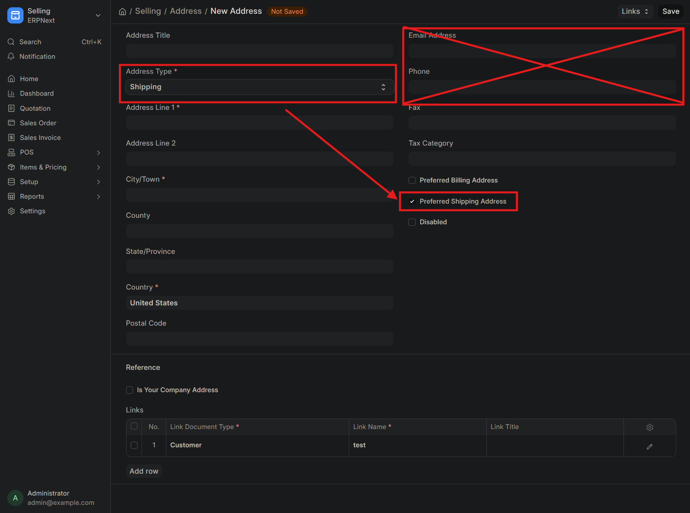

### Step 3: Save Address
Click **Save**. The new shipping address will now be available to be selected in other documents.

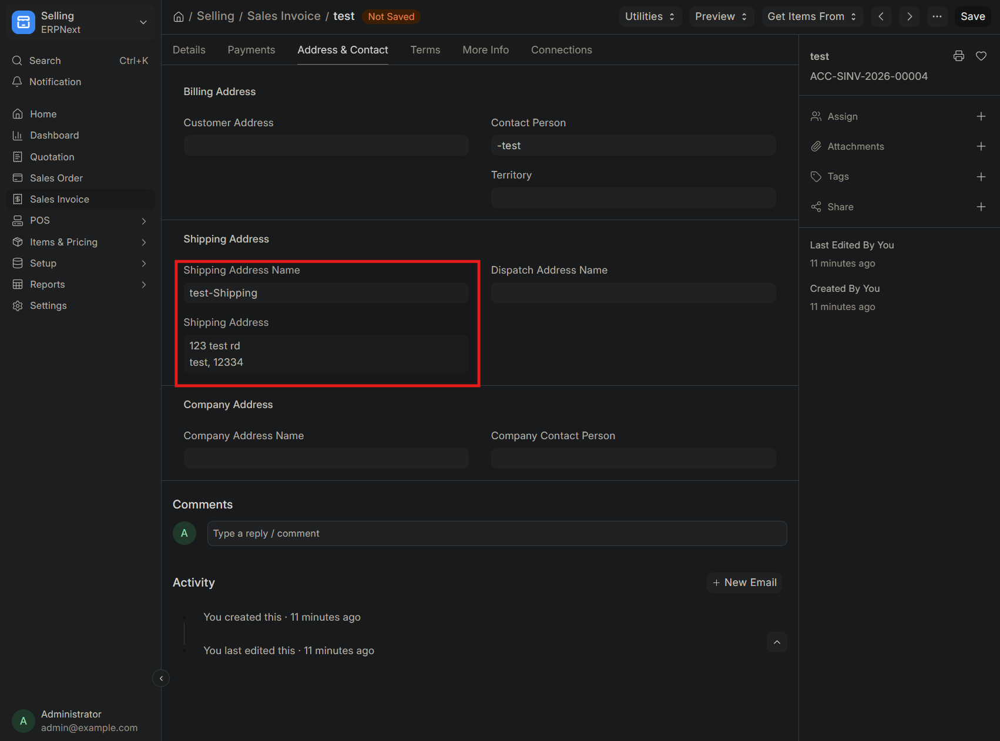