# LTL Shipping via Uber Freight

The process of booking Less-Than-Truckload (LTL) shipments using the Uber Freight platform is as follows:

---

## Create Shipment

### Step 1: Initiate Shipment

Log into the Uber Freight dashboard. Click on the **Create Shipment** button located at the top right.

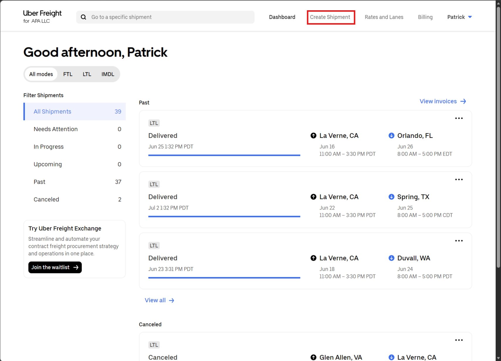

---

### Step 2: Select Service Type and Location

Under "Choose your service type", select **Less-than-truckload (LTL)**. Under "Pickup & delivery", select the APA LLC address (**1615 McKinley Ave, La Verne, CA 91750**).

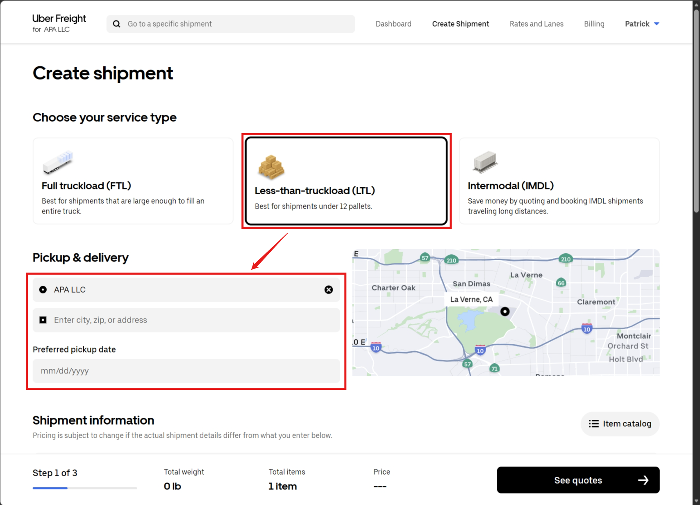

> [!IMPORTANT]
> Ensure the APA address at 1615 McKinley Ave, La Verne, CA 91750 is selected, not 1652.

> [!TIP]
> Pick-up are usually after 12 PM and must be scheduled 3 hours ahead. For best practices, always schedule in the morning as early as possible. If it's past 12:00 AM, schedule for the next day.

---

### Step 3: Enter Shipment Information

Fill out the shipment details (Commodity description, units, dimensions, weight).

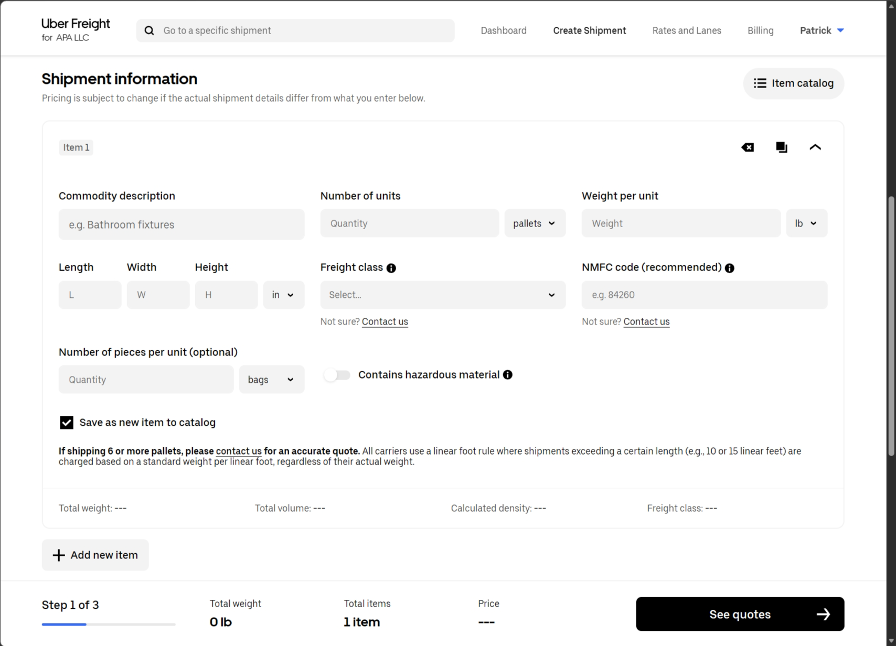

**Using the Item Catalog**: Click the **Item catalog** button on the top right to find or save commonly shipped items.

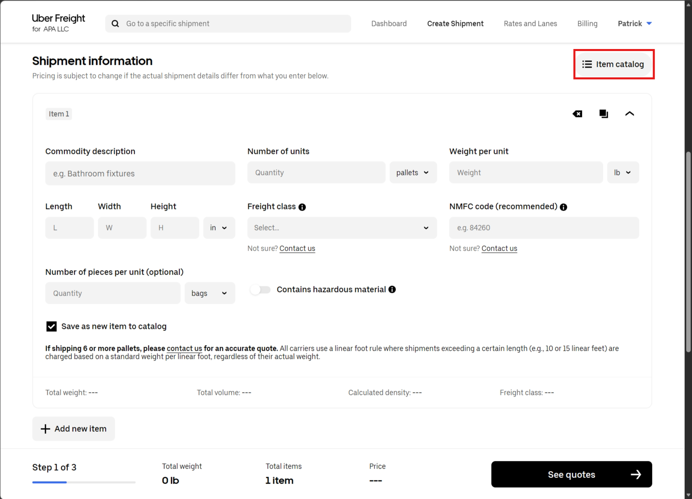 
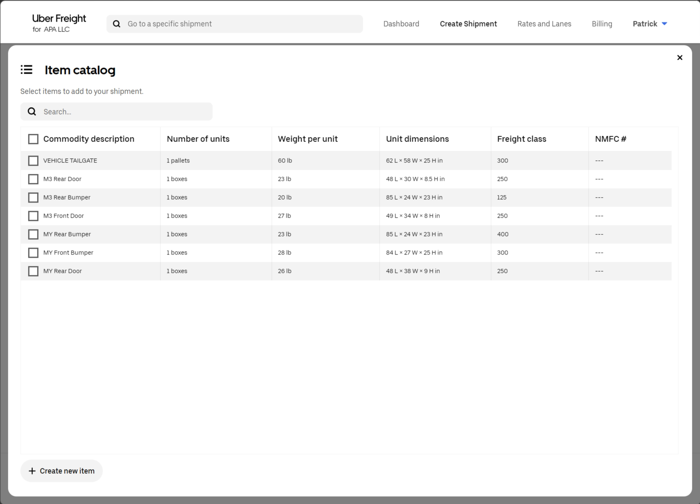

> [!TIP]
> When multiple items are bundled in one box, make sure to update the weight and dimension accordingly.

---

### Step 4: Select Accessorials and Request Quotes

Choose any necessary accessorials (e.g., liftgate). Click the **See quotes** button at the bottom right.

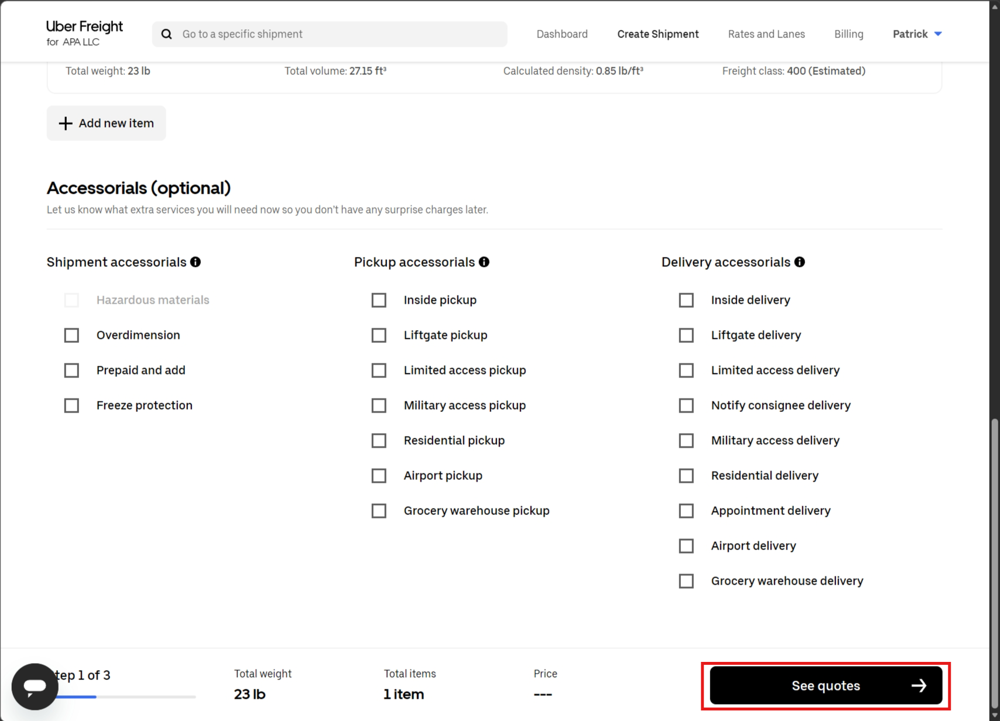

---

### Step 5: Select Carrier Quote

Review the provided carrier options, estimated delivery dates, and prices. Select the best value carrier for the shipment.

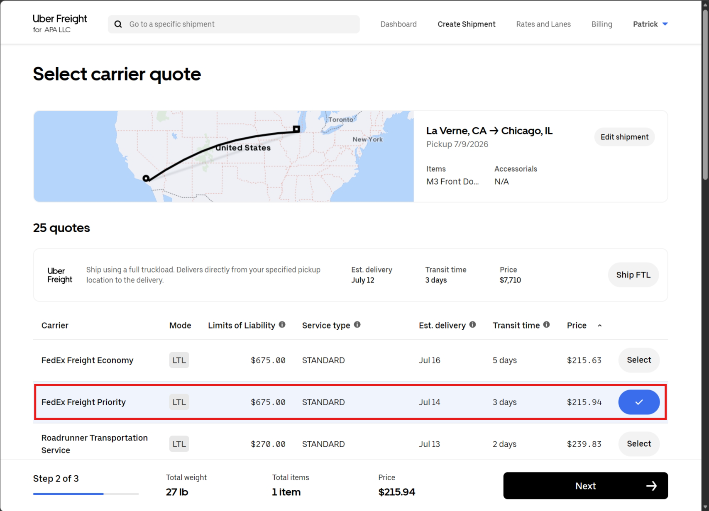

> [!TIP]
> Pay attention to the numbers and select the best value one. For example, FedEx Priority in this case is almost the same price as FedEx Economy.

---

### Step 6: Finalize Pickup Information

On the "Finalize shipment details" page, click **Edit pickup info**.

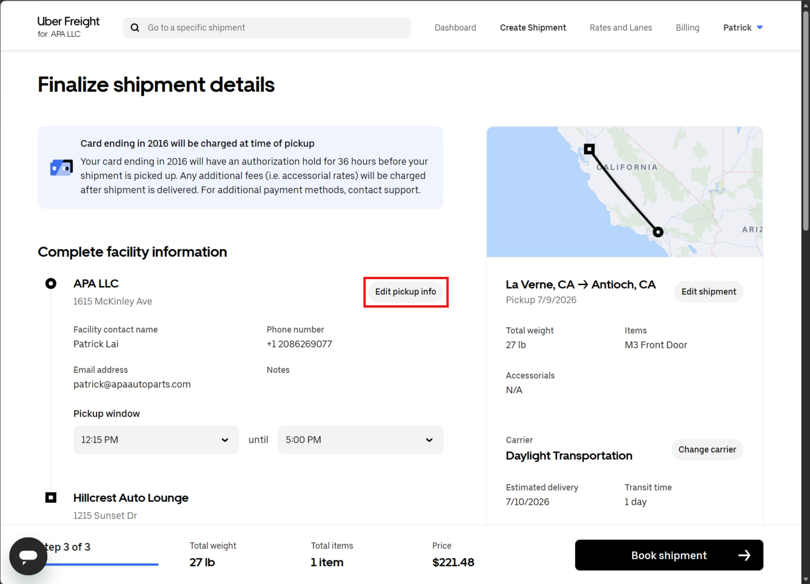

Verify the contact name, phone number, and email. 

> [!CAUTION]
> Double-check the contact information to make sure it's not another employee's contact info.

In the additional notes or instructions section for the pickup information, add the following exact note:
`Please call ### (your company phone number) when arrived, the shipment will be brought to the driver.`

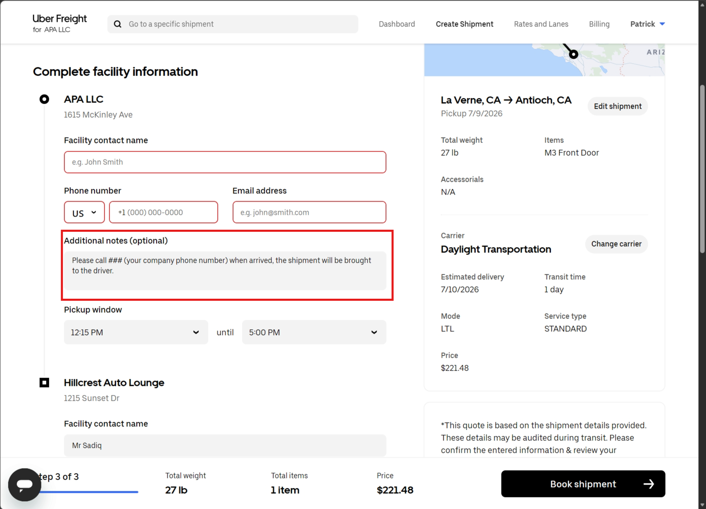

---

### Step 7: Enter References and Book Shipment

Input any relevant reference numbers, PO numbers, or special instructions. Review all details one last time. Click the **Book shipment** button to finalize.

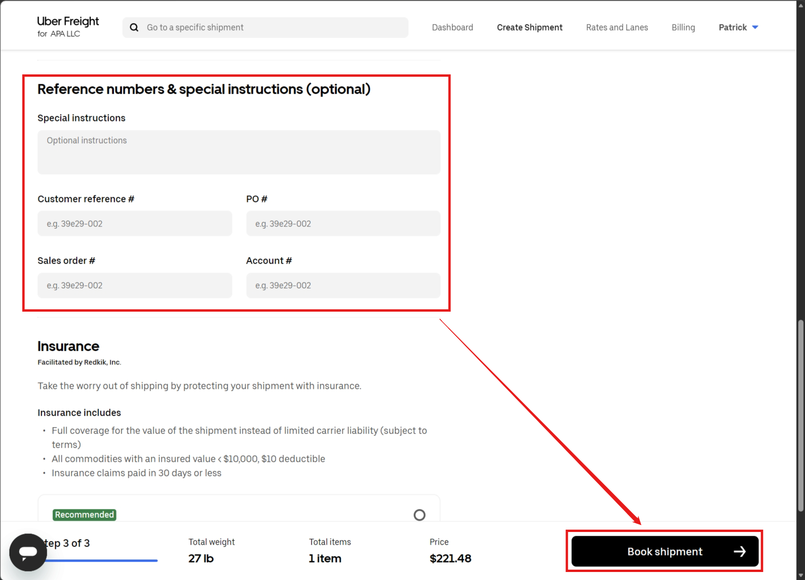

---

### Step 8: Download and Sign Bill of Lading (BOL)

Navigate to the **Documents** section on the right side of the shipment details page. Click the download icon next to **Bill of lading**. Print out two copies of the BOL and sign both copies in the designated **Shipper Signature** area at the bottom left.

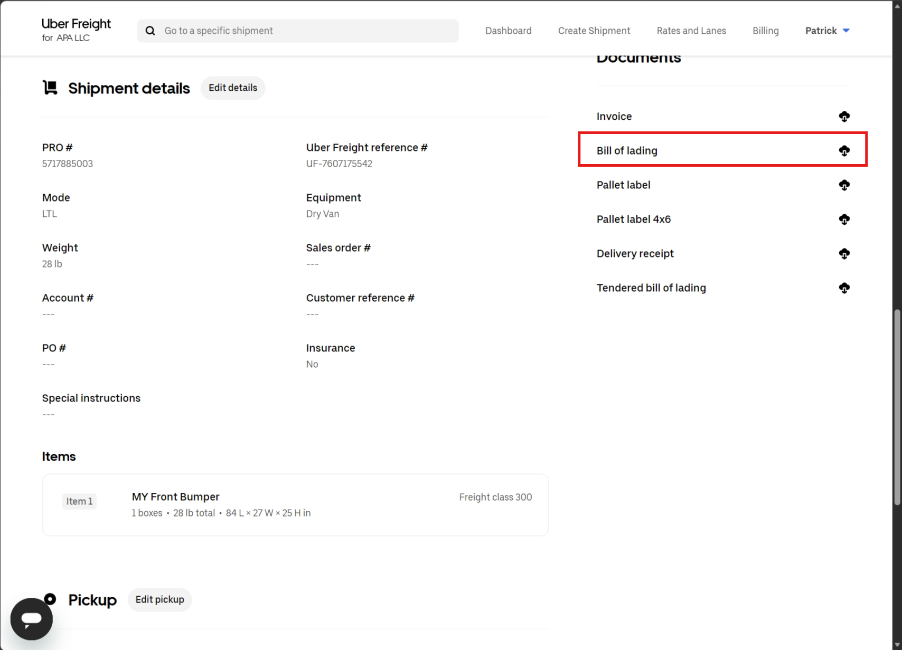

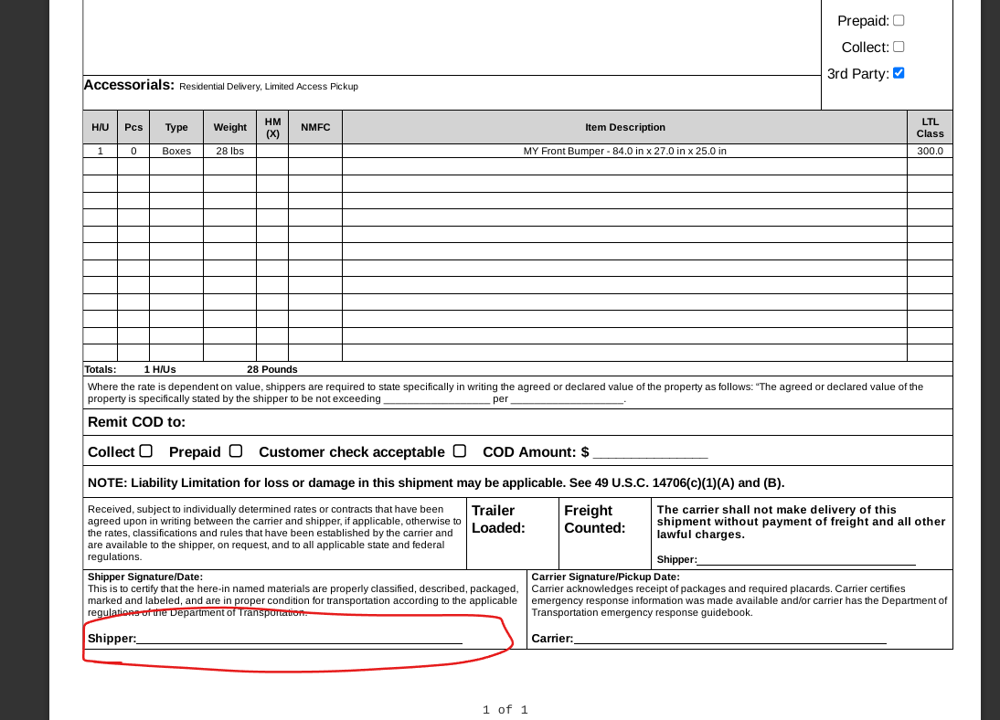

---

### Step 9: Print and Attach Pallet Label

Navigate back to the **Documents** section and click the download icon next to **Pallet label**. Print the pallet label and securely attach it to the shipment.

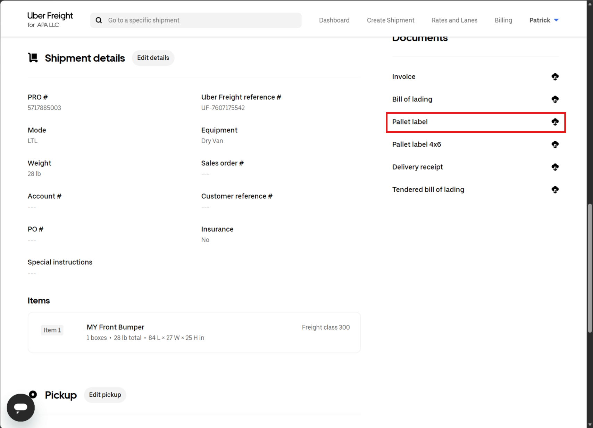

---

### Step 10: Handle Driver Pickup and PRO Label

During pickup, the driver will attach a PRO label to both copies of the BOL. The driver will take one copy and leave you with the other. Scan the tendered BOL with the attached PRO label.

> [!IMPORTANT]
> You must [send the scanned BOL to the customer](../system-communications/system-communications.md#step-3-add-tracking-or-attachments) as this is a crucial step that is often forgotten.

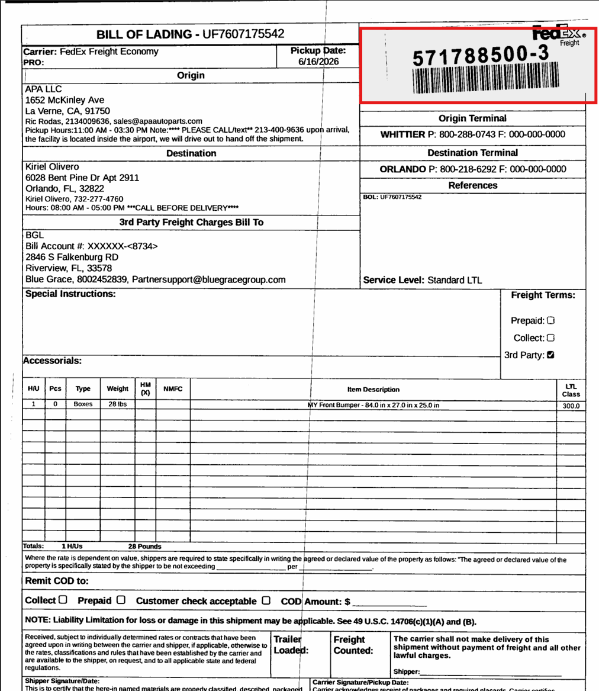
