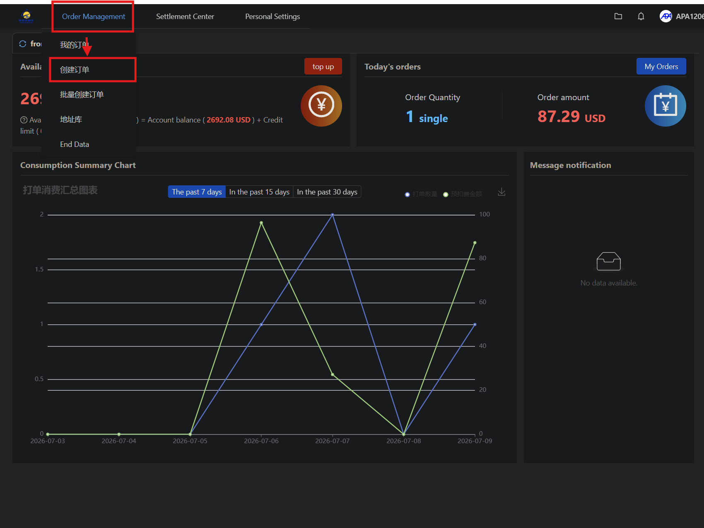
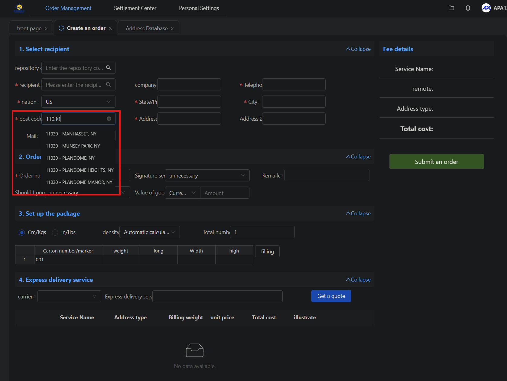
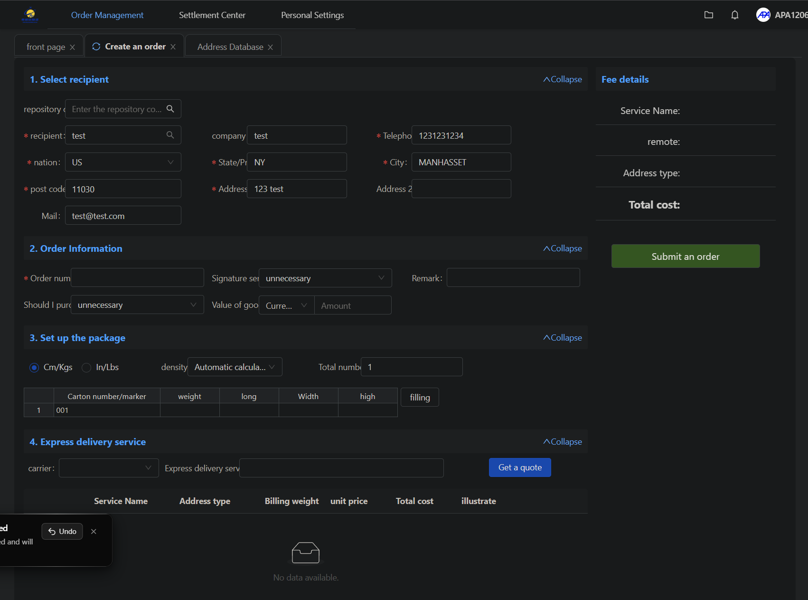
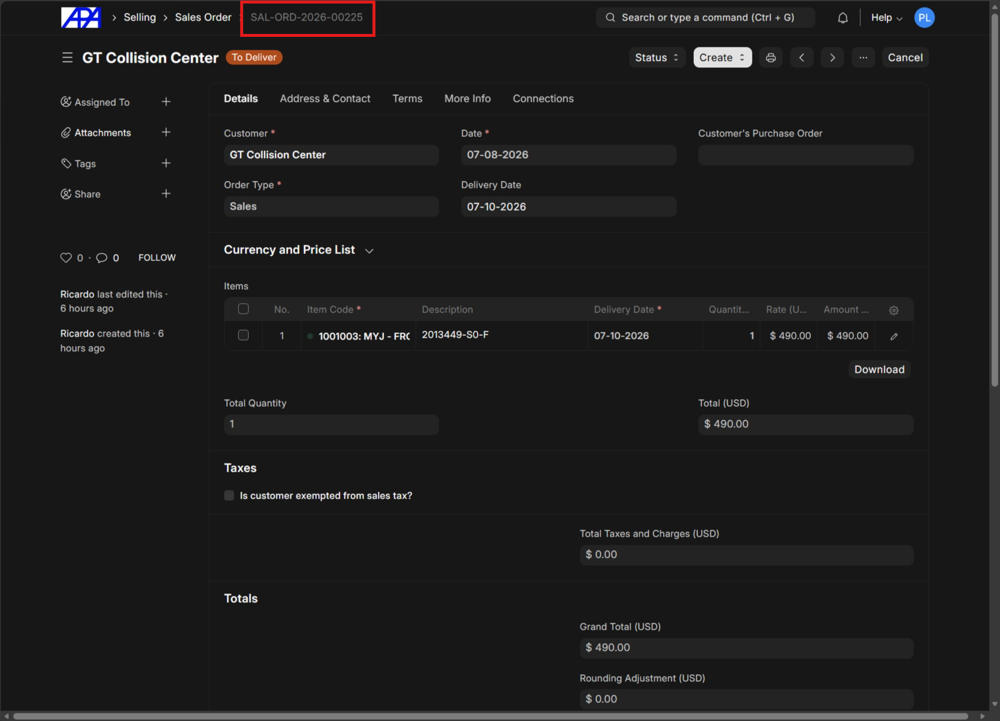
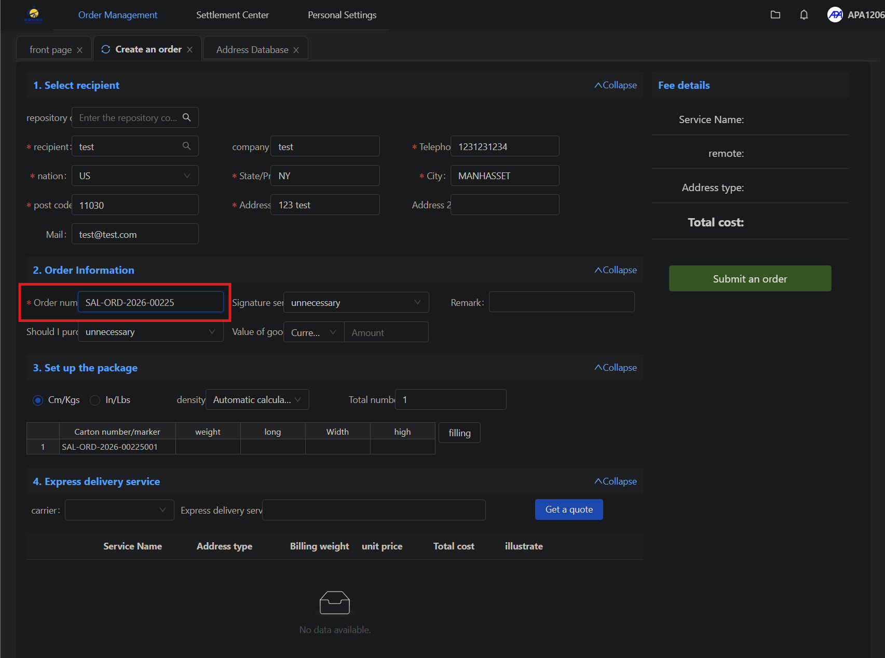
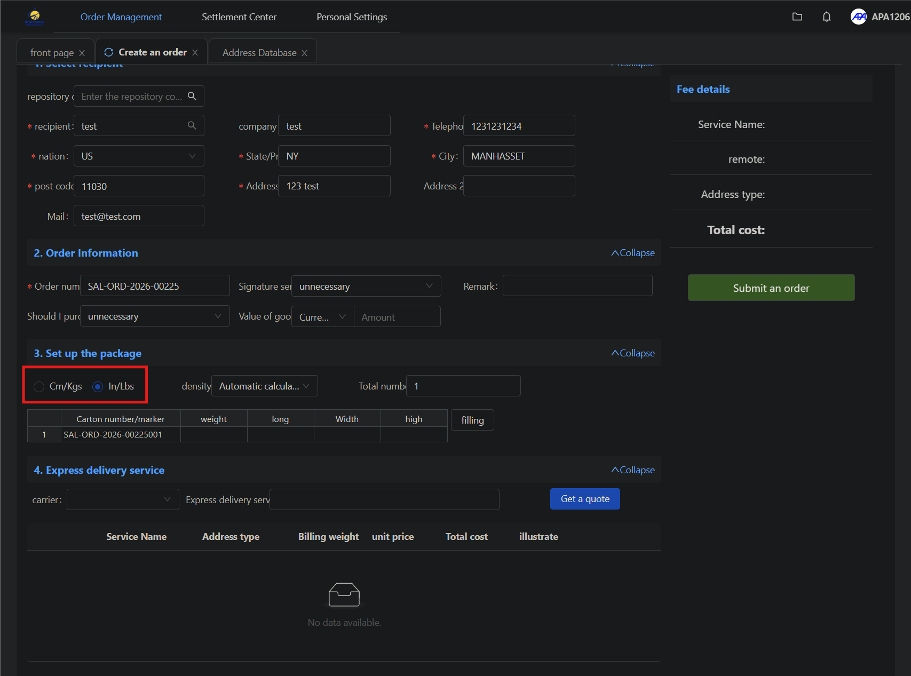
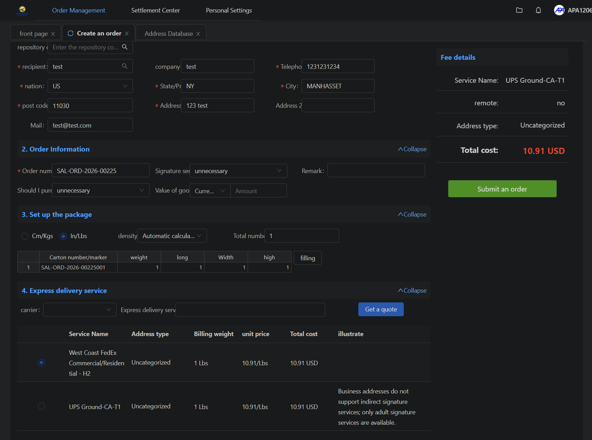
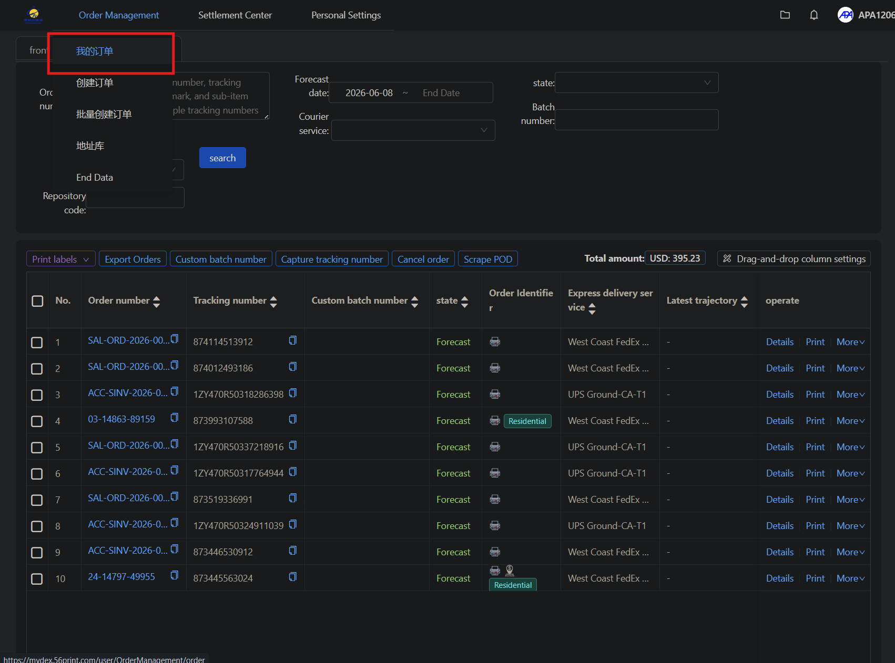
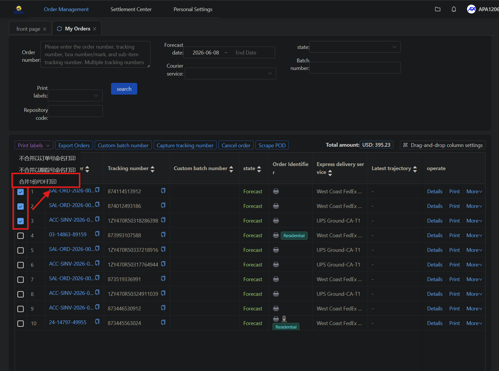
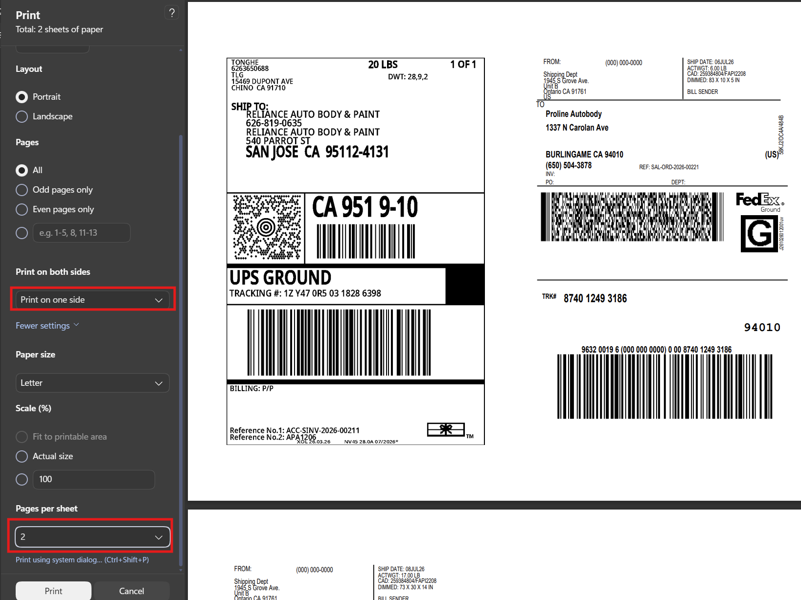

# Regular Package Shipping Process

This document describes the process for generating package shipments, obtaining quotes, and printing shipping labels using the 56print platform.

## Create Shipment

### Step 1: Navigate to Create Order

Log into `https://mydex.56print.com/user/index`. Hover over the **Order Management** menu and select **Create an order**.

### Step 2: Enter Recipient Postal Code

In the **Select recipient** section, input the recipient's postal code in the **post code** field first.

> [!TIP]
> Always enter the postal code first, as it will auto-fill the state and city. Because pricing is based on the postal code, this enables rapid shipping quotes by filling in the remaining recipient information with sample addresses instead of their actual address if you just need a quick quote.

### Step 3: Fill Remaining Recipient Information

Fill in the remaining required recipient fields such as **recipient**, **company**, **Telephone**, and **Address**.

### Step 4: Link Sales Order

In the ERP system, click on the respective sales order title at the top of the page to copy the sales order number.

Paste the copied sales order number into the **Order number** field in the **2. Order Information** section on the 56print portal.

### Step 5: Input Package Details

In the **3. Set up the package** section, select **In/Lbs** as the unit, then input the package dimensions and weight.

> [!IMPORTANT]
> Make sure to select the correct unit, which is **In/Lbs** (pound-inch and pounds) in the package details section. The default setting is cm/kgs.

### Step 6: Get Shipping Quote

In the **4. Express delivery service** section, click the **Get a quote** button. The system will automatically select the cheapest available shipping option.

---

## Print Labels

### Step 1: Navigate to My Orders

Hover over the **Order Management** menu and select **My Orders** (我的订单).

### Step 2: Combine and Print Labels

Select the checkboxes next to one or multiple orders you wish to print labels for. Click the **Combine 1 PDF to print** (合并1份PDF打印) button.

### Step 3: Configure Print Settings

In the browser's printing dialogue, configure the settings before printing:

- Set **Print on both sides** to **Print on one side**.
- Set **Pages per sheet** to **2**.

> [!NOTE]
> Even if you are printing just one label, you must still use the two pages per sheet setting.

