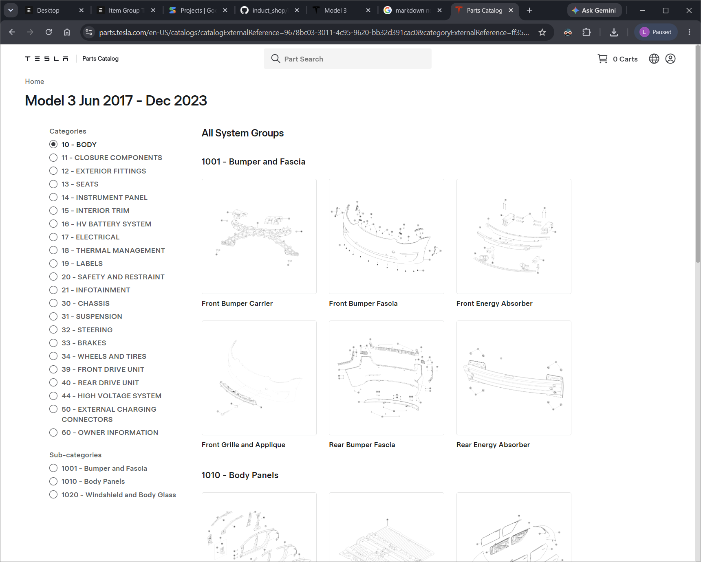

# APA Part Number Guide

## Tesla OE Part Numbers

Tesla OE part numbers are generally structured with a base component identifier followed by a specific revision level:

* **Base Part Number:** A 7-digit identifier (e.g., `1974875`) representing the core component.
* **Revision:** A suffix (e.g., `-00-C`) indicating the specific version or revision of the part.

Together, a complete Tesla OE part number typically looks like `1974875-00-C`.

> [!IMPORTANT]
> **Important Note:** For compatibility purposes, always use the **base part number** (e.g., `1974875`) as the main identifier. While the revision (e.g., `-00-C`) is useful for tracking specific versions, the base part number remains consistent across revisions and should be used for searching, stock management, and reporting.

## APA Part Numbers

APA partnumber utilizes tesla's OE categorization system for part classification, you should familiarise yourself with [Tesla's OE part catalog](https://parts.tesla.com/en-US/landingpage) for user friendly part category lookup.

### Gen 1 Part Numbers

The APA Gen 1 part numbers use a 6-digit structure formatted as: **[Model] [Category] [Serial]**.

* **Model (1 digit):** Identifies the vehicle model (e.g., `3` for Model 3, `4` for Model Y).
* **Category (2 digits):** Represents the main component category, mapped from standard Tesla service categories (e.g., `10` for BODY, `12` for EXTERIOR FITTINGS, `15` for INTERIOR TRIM).
* **Serial (3 digits):** A randomly assigned serial number to uniquely identify the part.

#### Examples

* `310001`: A Model 3 part (`3`) belonging to the BODY category (`10`), with serial number `001`.
* `412001`: A Model Y part (`4`) belonging to the EXTERIOR FITTINGS category (`12`), with serial number `001`.

### Gen 2 Part Numbers

The APA Gen 2 part numbers use a 7-digit structure formatted as: **[Subcategory] [Serial]**.

* **Subcategory (4 digits):** Identifies the specific subcategory of the part, which inherently includes the main category. This maps directly to Tesla's standard service subcategories (e.g., `1001` for Bumper/Fascia, where the first two digits `10` represent the BODY category).
* **Serial (3 digits):** A randomly assigned serial number to uniquely identify the part within that subcategory.

> [!NOTE]
> **Vehicle Model Distinctions**
> Unlike Gen 1, Gen 2 part numbers **do not** distinguish between vehicle models (e.g., Model 3 vs. Model Y) within the part number itself. Instead, model compatibility is distinguished via the item name inside the ERP system using specific prefixes:
>
> * **`M3H`**: Indicates a 2024+ Model 3 (Highland) part.
> * **`MYJ`**: Indicates a 2025+ Model Y (Juniper) part.

#### Examples

* `1001001`: A part belonging to the Bumper/Fascia subcategory (`1001`), with serial number `001`. Its model compatibility would be defined in its item name (e.g., `M3H - Front Fascia Unpainted`).
