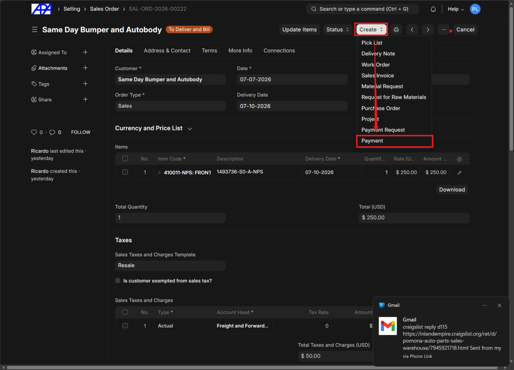
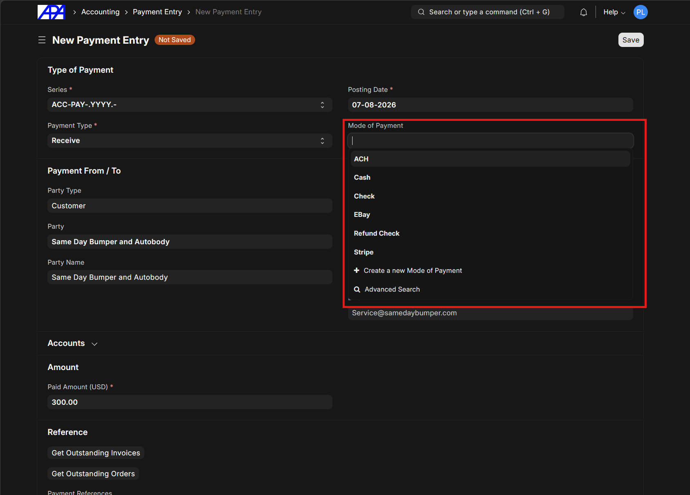
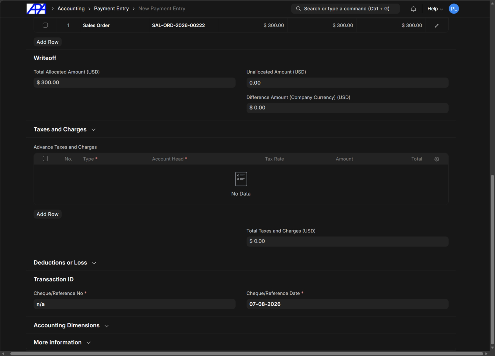
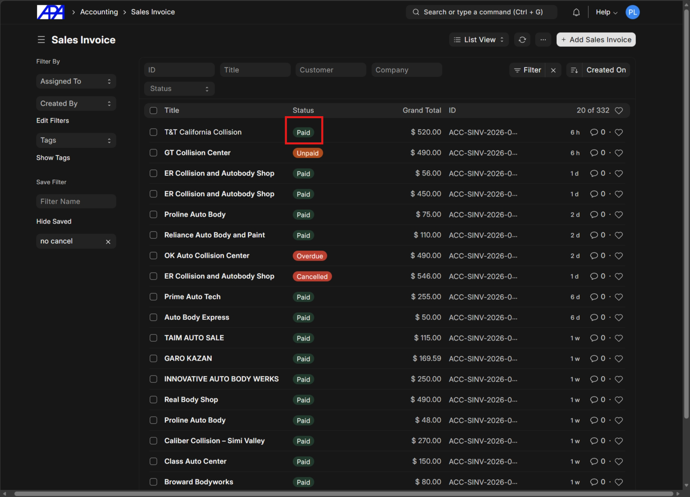
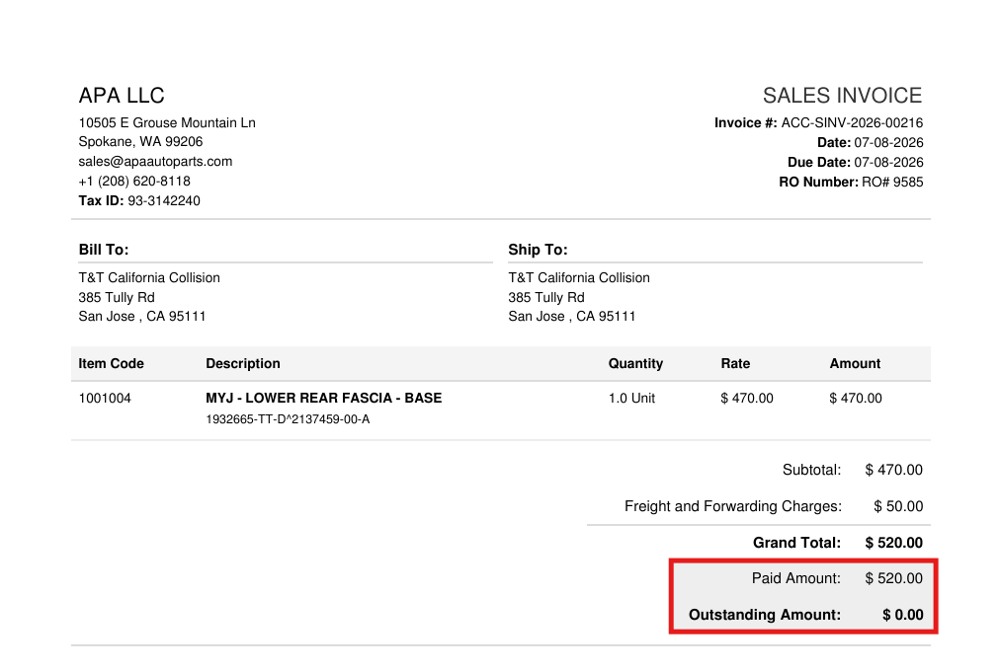

This guide explains how to record a payment against a Sales Order or Sales Invoice.

## Record a Payment

### Step 1: Initiate Payment
Navigate to the relevant Sales Order or Sales Invoice.
- Click the **Create** button in the top right corner.
- Select **Payment** from the dropdown menu to open a new Payment Entry.

> [!NOTE]
> Typically, payments for non-local orders are recorded via the Sales Order, while payments for local orders are recorded via the Sales Invoice.

### Step 2: Select Mode of Payment
In the New Payment Entry screen, locate the **Mode of Payment** field and select the appropriate payment method from the dropdown list (e.g., ACH, Cash, Check, Stripe).

### Step 3: Enter Reference Details
Scroll down to the **Transaction ID** section. 
- Enter the reference number in the **Cheque/Reference No** field. 
- Ensure the **Cheque/Reference Date** is correct.

> [!TIP]
> Unless the reference number is easily accessible, entering "n/a" is acceptable.

### Step 4: Save and Submit
Review the payment details, then **Save** and **Submit** the payment entry.

### Step 5: Verify Payment Status
Once the payment is submitted, the system will update the associated records.
- In the Sales Invoice list view, the invoice status will update to **Paid**.
- On the printed invoice, the **Paid Amount** and **Outstanding Amount** will accurately reflect the payment.

