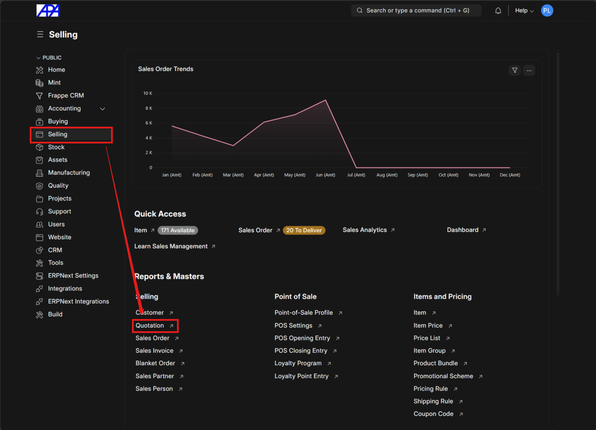
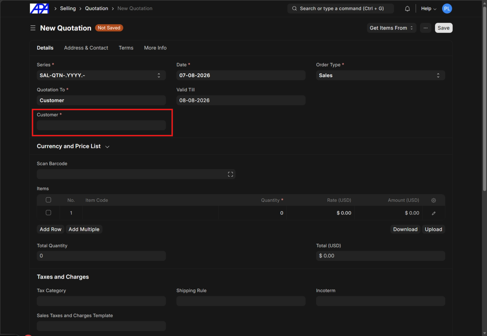
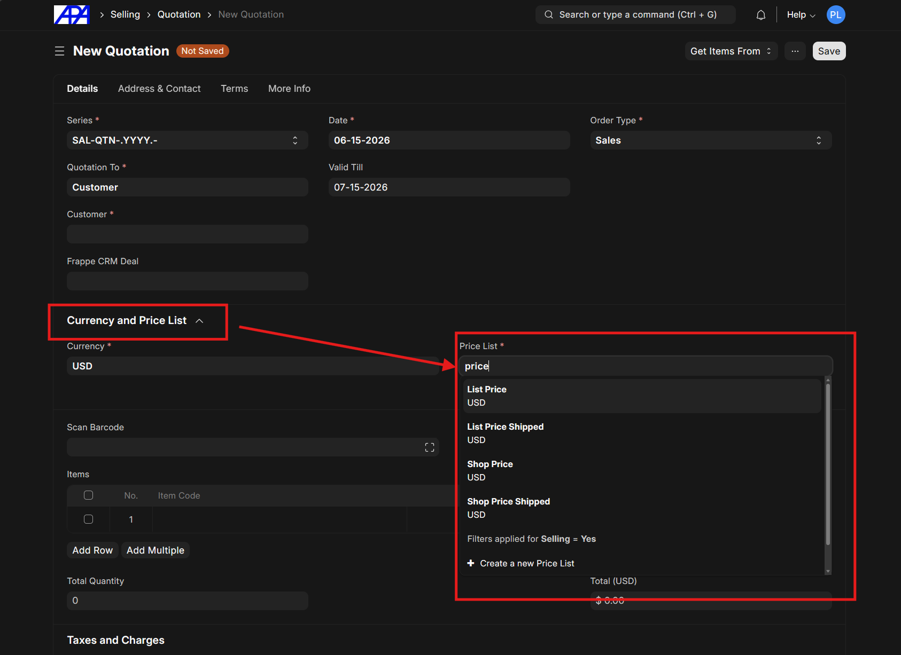
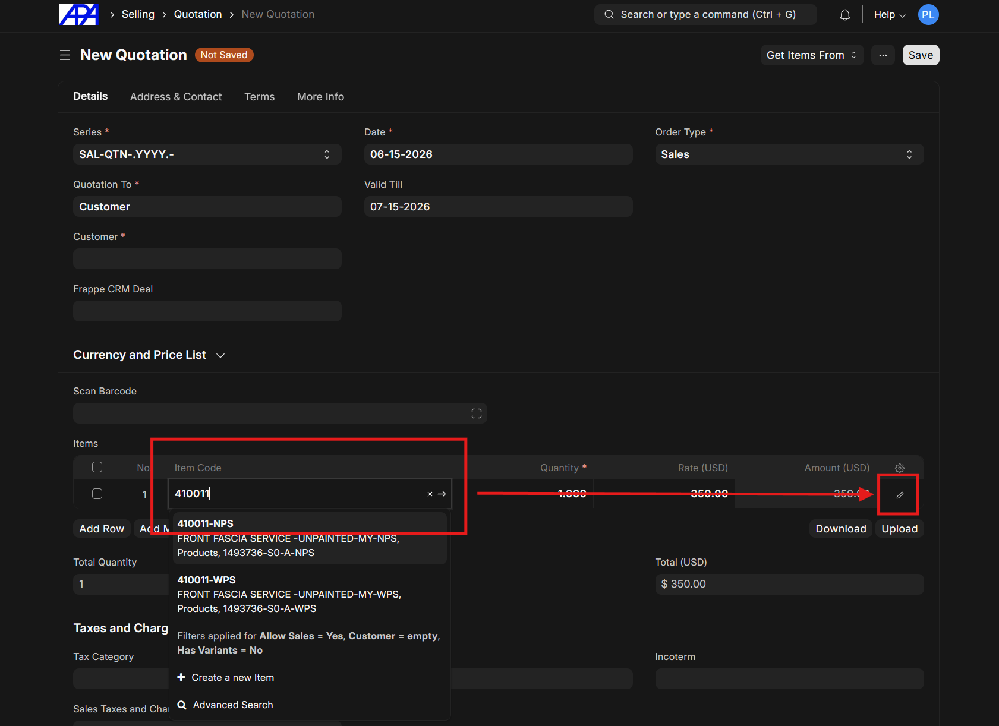
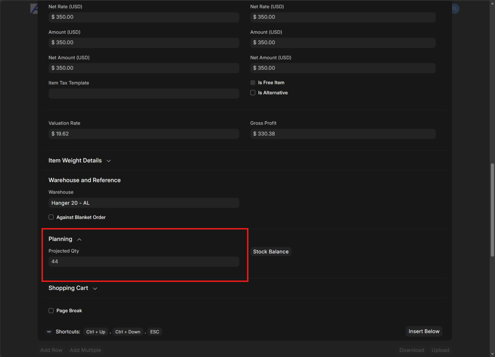
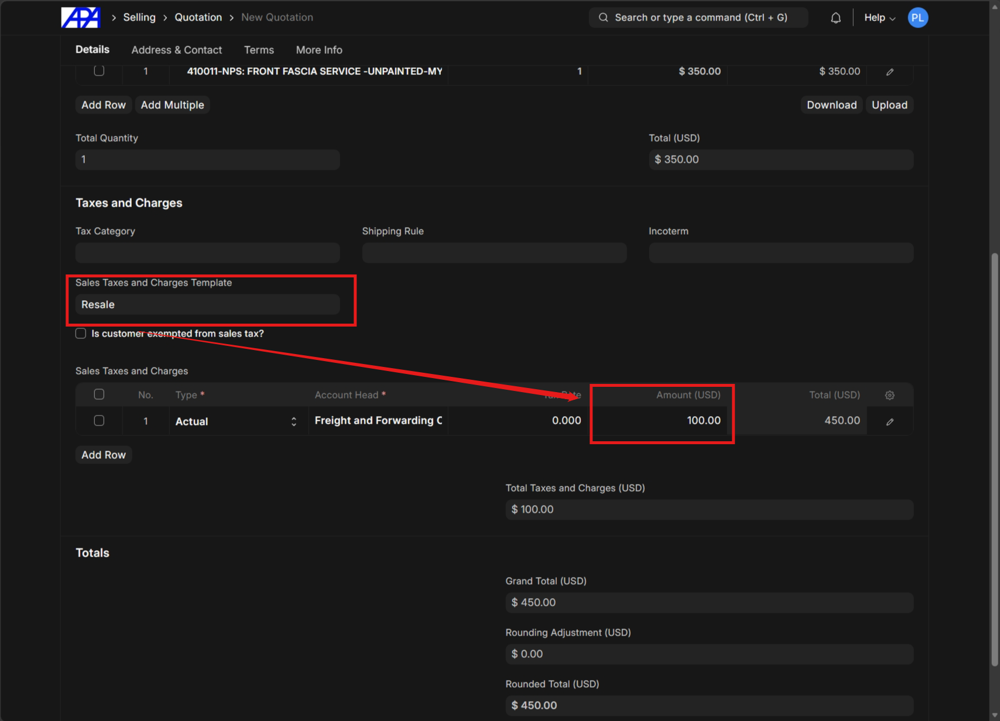
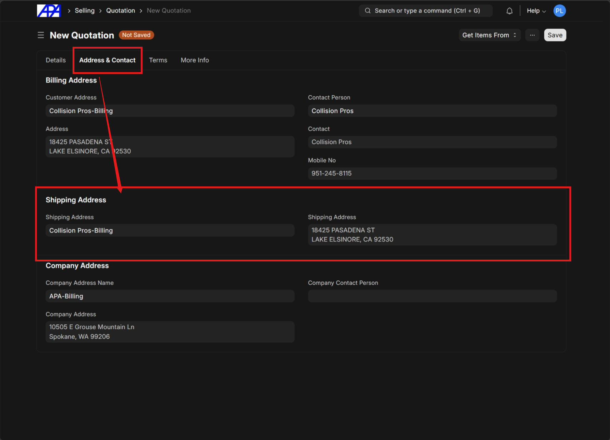
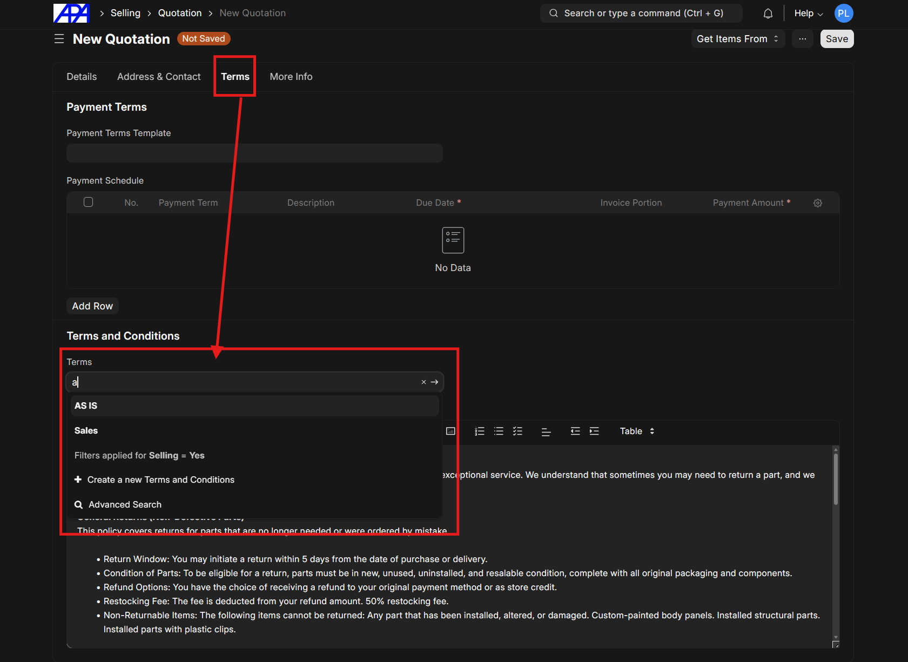
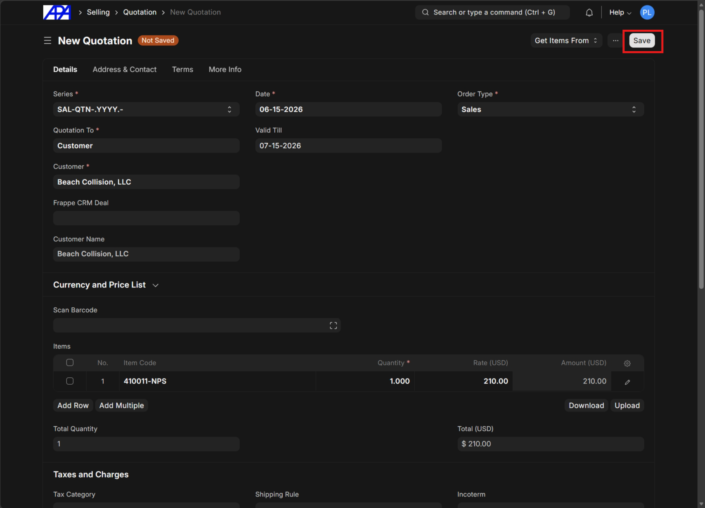
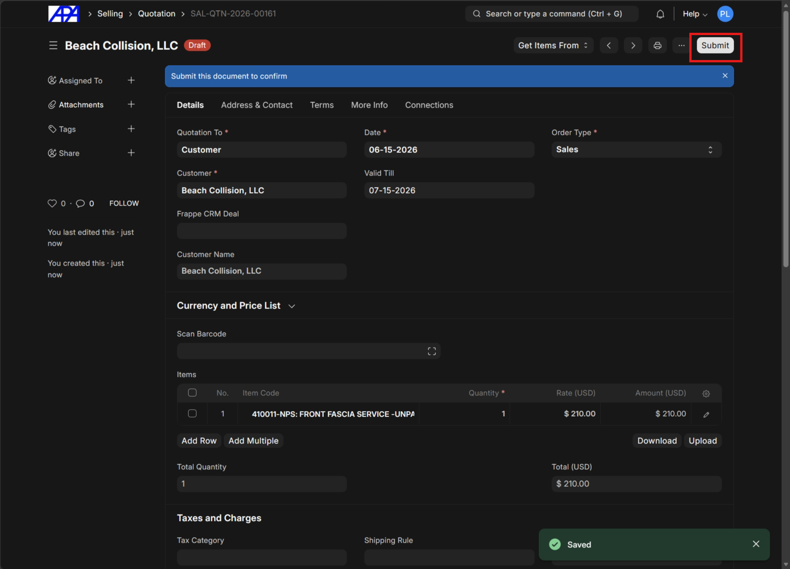

# Create Quotation

### Step 1: Navigate to Quotation List

Navigate to the quotation list and click **"Add Quotation"**.

### Step 2: Select Customer

Identify the applicable customer scenario before proceeding:

- **Insurance**
- **Generic shop**
- **Existing customer**

See [Identify Customer Type](../sales-workflow/standard_sales_workflow.md#step-0-identify-customer-type) for more details.

> [!NOTE]
> Review how to properly [add a customer](../add-customer/add-customer.md) if the customer is completely new.

### Step 3: Select Price List

Select the appropriate price list in the **"Currency and Price List"** section.

### Step 4: Add Items & Check Inventory

Select items and click on the small pencil icon. Navigate to the **"Planning"** section to check inventory availability.

> [!TIP]
> For part lookup, see the [APA Part Number Guide](../part-number/part-number.md).

### Step 5: Configure Taxes & Charges

In the **"Taxes and Charges"** section, select **"Resale"** under the **"Sales Taxes and Charges Template"** and add the appropriate shipping charges.

### Step 6: Configure Shipping Address

Configure the shipping address if it is different from the customer's billing address on file.

### Step 7: Select Terms & Conditions

In the **Terms** section, select the appropriate sales terms and conditions.

### Step 8: Save and Submit

Click on **"Save"** and **"Submit"** after confirming all details.

