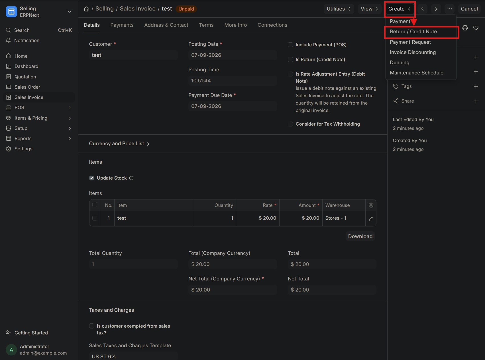
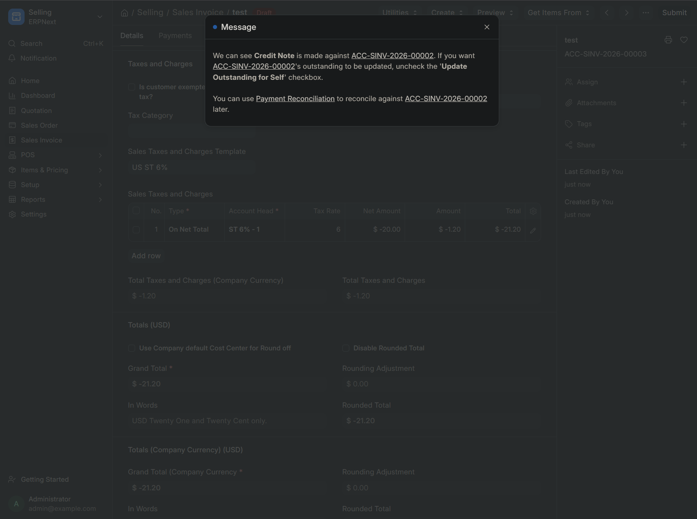
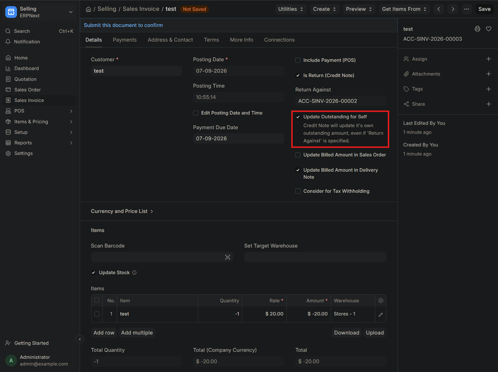
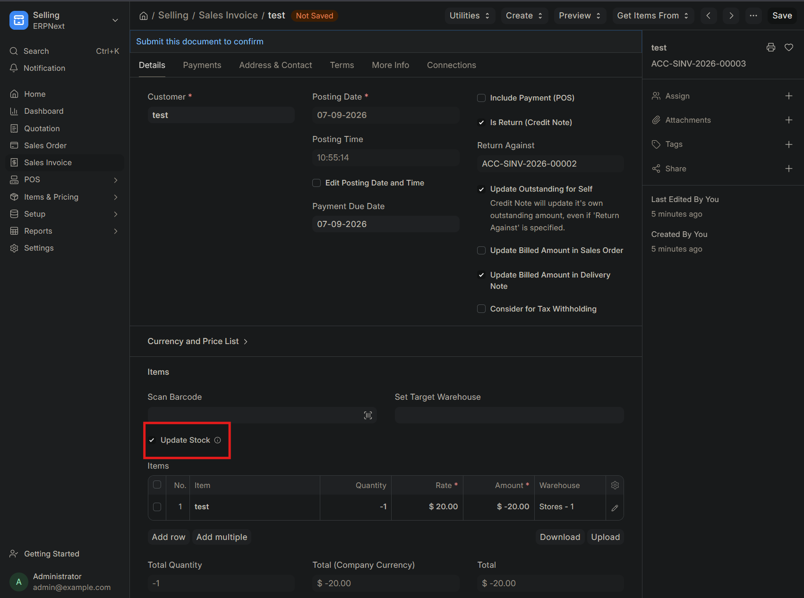
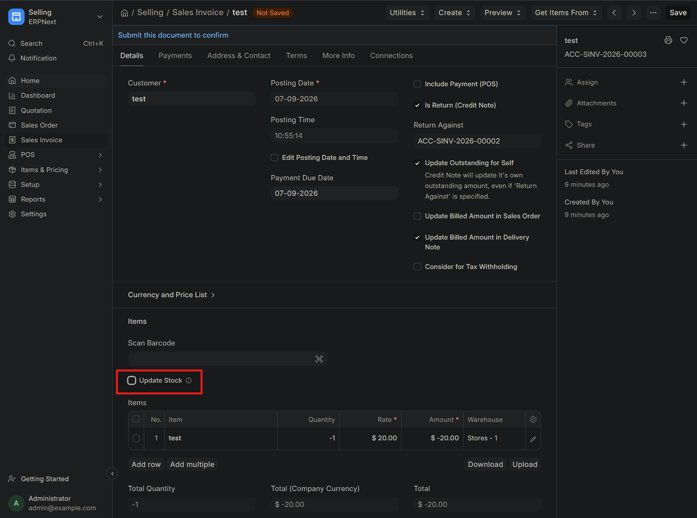
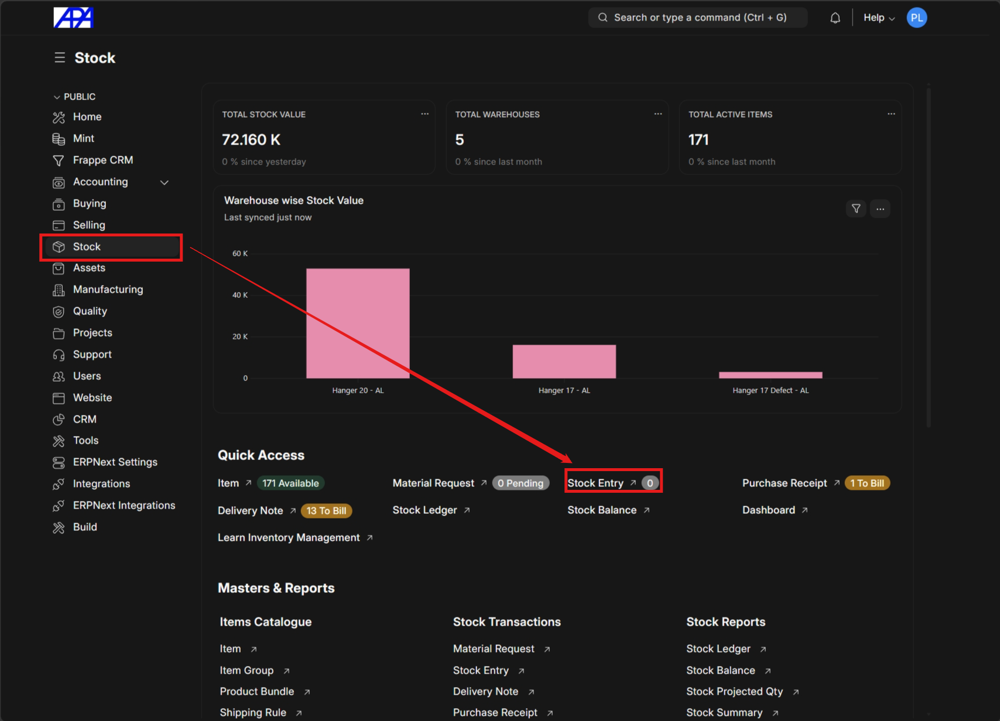
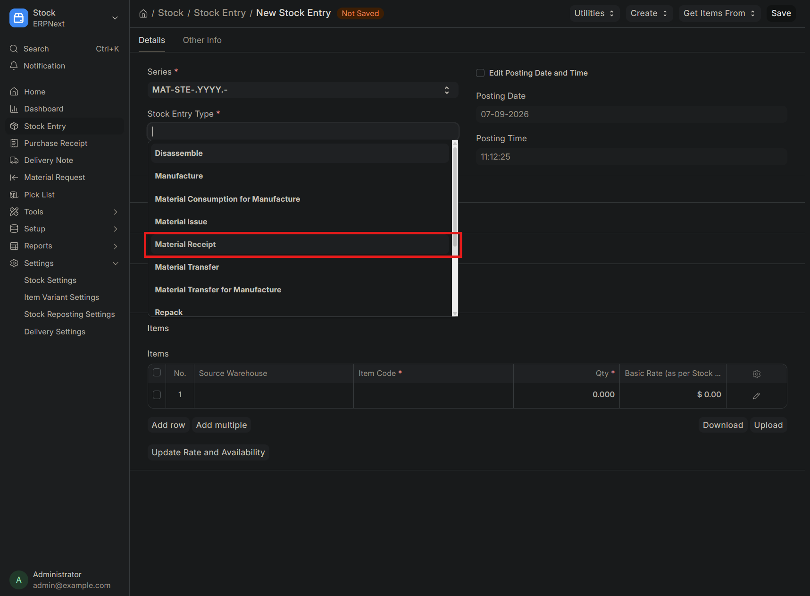
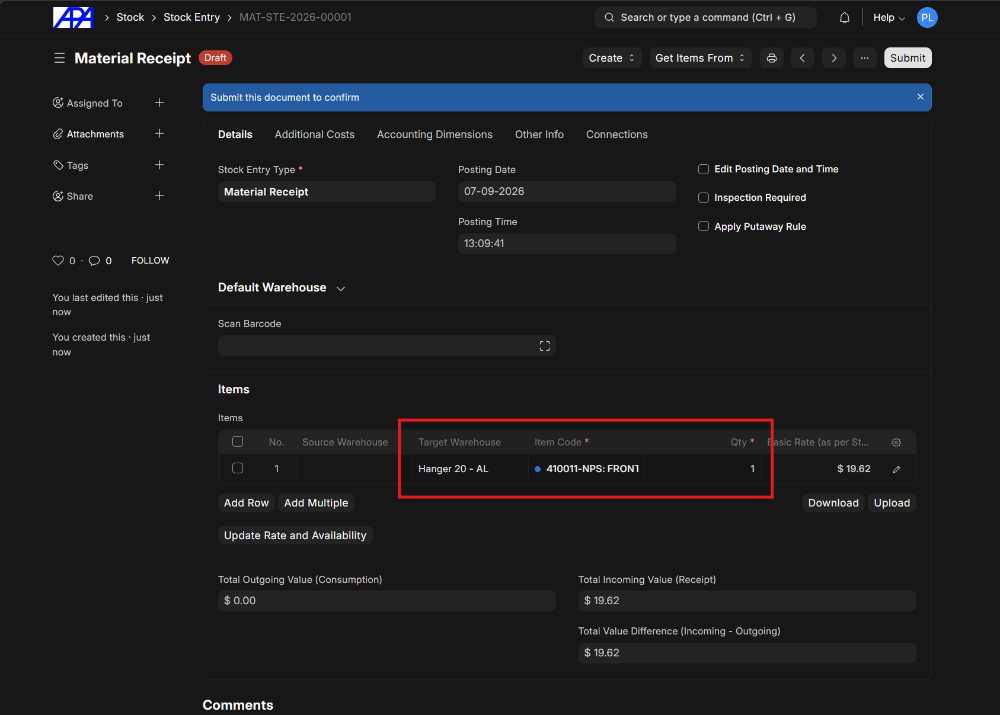
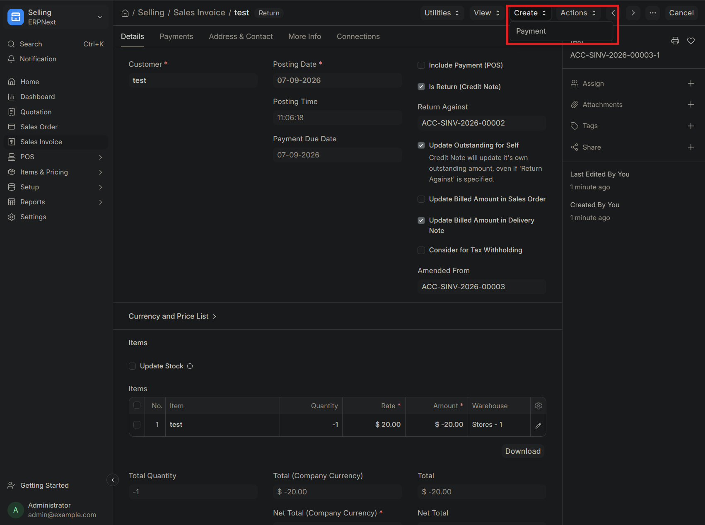
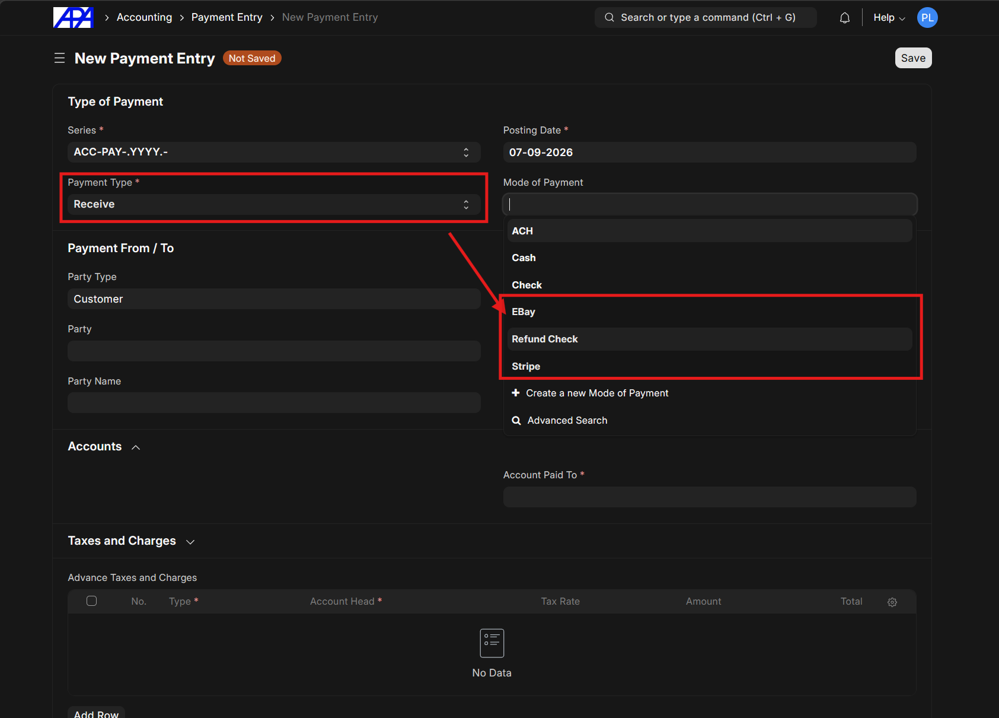

This procedure outlines the steps to process a return and create a credit note for a sales invoice.

## Create Credit Note

### Step 1: Create Return / Credit Note

From the Sales Invoice, click the **Create** button and select **Return / Credit Note**.

### Step 2: Configure Outstanding Amount Update

Configure the outstanding amount setting based on the payment status of the original invoice.

> [!IMPORTANT]
>
> - **If the invoice is already paid**: Leave the **Update Outstanding for Self** checkbox checked.
> - **If the invoice is not paid yet**: Uncheck the checkbox so that the original invoice's outstanding amount is updated.

---

### Scenario 1: Local Return

If the return is local, where the driver brings the item back from delivery, follow these steps.

### Step 3: Update Stock

Ensure the **Update Stock** checkbox is checked in the Items table.

> [!NOTE]
> If the customer made a prepayment, skip to the [Process Refund Payment](#process-refund-payment) section

### Step 4: Save and Submit

Click **Save** and then **Submit** to finalize the return.

---

### Scenario 2: Non-local Return

If the order is non-local and requires the item to be shipped back, follow these steps.

### Step 3: Disable Stock Update

Uncheck the **Update Stock** checkbox in the Items table.

### Step 4: Save and Submit

Click **Save** and then **Submit** to finalize the return record.

### Step 5: Send Return Label

Send an [email with the return label](../system-communications/system-communications.md#sales-invoice) to the customer.

### Step 6: Create Stock Entry

Once the return package is received, navigate to the Stock module and click **Stock Entry** in the Quick Access area.

### Step 7: Configure Material Receipt

Create a new Stock Entry and set the **Stock Entry Type** to **Material Receipt**.

### Step 8: Set Target Warehouse

In the Items table, set the **Target Warehouse** to the appropriate location (e.g., Hanger 20 - AL).

---

## Process Refund Payment

### Step 1: Create Payment

From the submitted Return Sales Invoice, click **Create** and select **Payment**.

### Step 2: Configure Payment Details

Set the **Payment Type** to **Receive** and select the appropriate **Mode of Payment** to refund the customer.

> [!CAUTION]
> Make sure the **Payment Type** is set to **Receive** to correctly process the refund to the customer.

### Step 3: Complete Payment Record

Proceed to [complete the payment record](../payment/payment.md).
