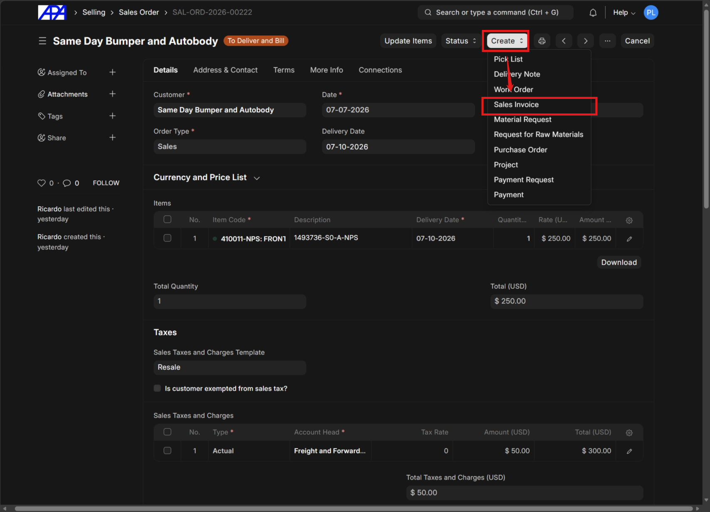
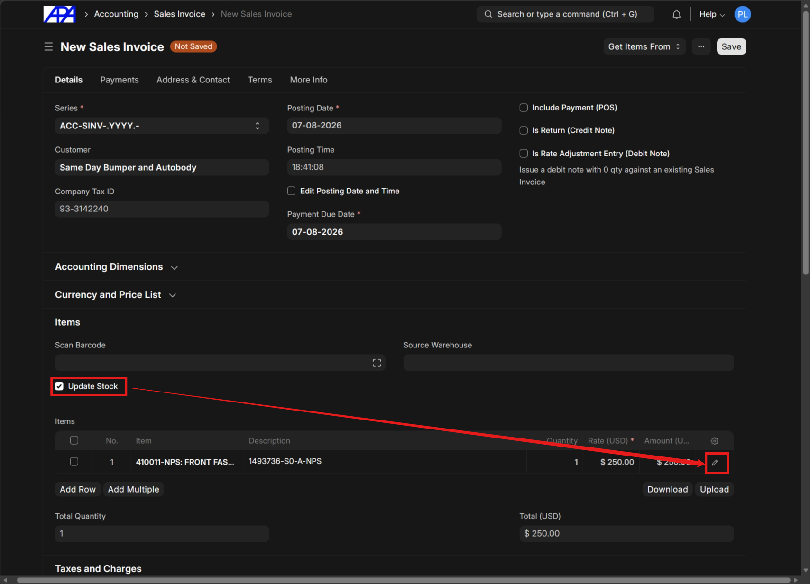
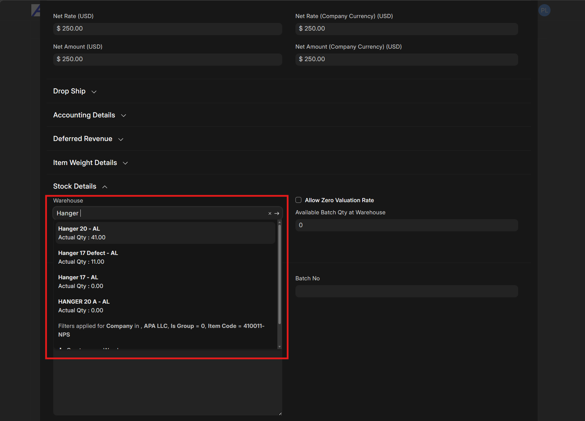
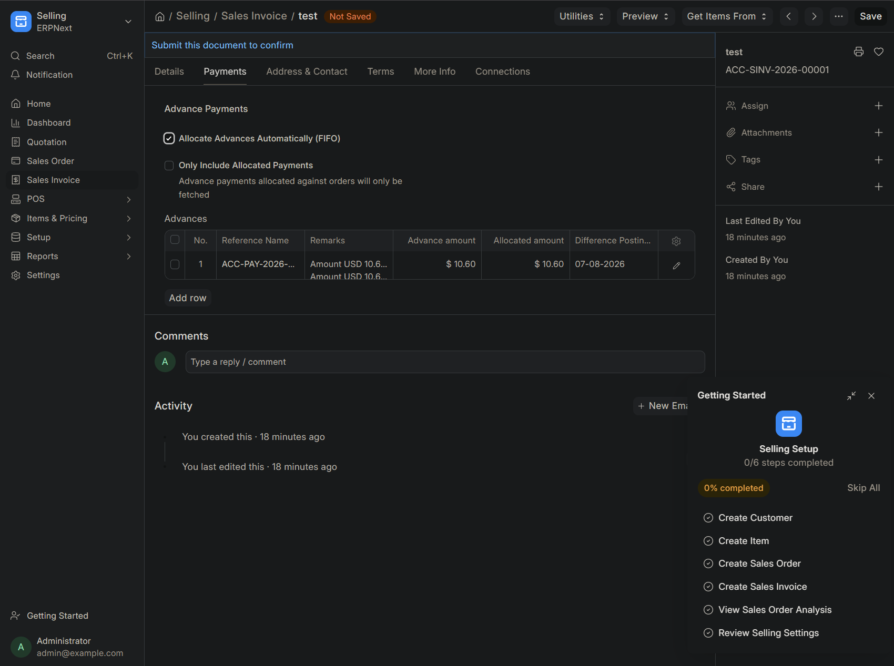
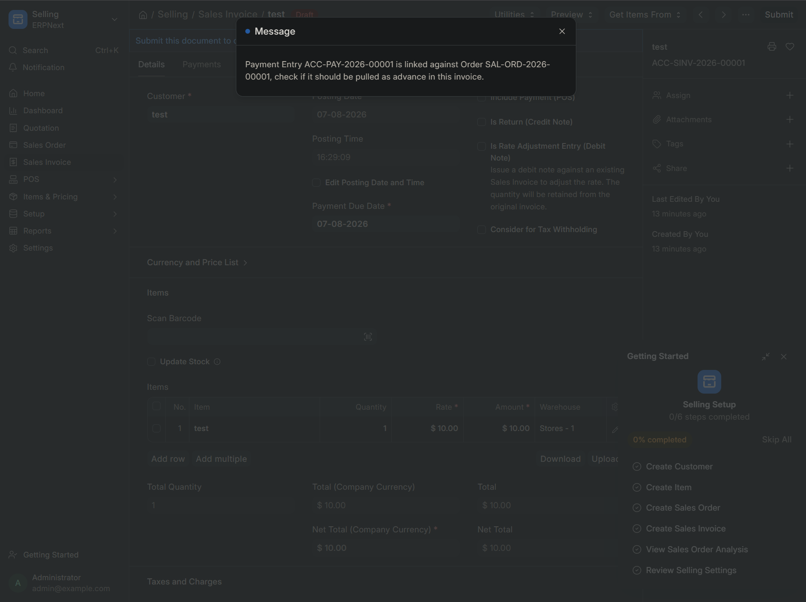

# Invoicing

This document details the procedure for generating a Sales Invoice (SI) from a Sales Order (SO).

> [!IMPORTANT]
> You should always create Sales Invoices directly from Sales Orders. Only Sales Orders track both delivery and billing, ensuring you do not miss any orders.

## Create Sales Invoice

### Step 1: Create Invoice from Sales Order

From the active Sales Order, click the **Create** button in the top right corner and select **Sales Invoice** from the dropdown menu.

### Step 2: Update Stock and Item Details

On the New Sales Invoice page, scroll to the Items section and check the **Update Stock** box. Then, click the **Edit** icon (pencil) on the specific item row to open its details.

> [!NOTE]
> If you forget to check the **Update Stock** box, or if a situation requires not updating the stock immediately (e.g., if it takes multiple days to pick an order), you can use a Delivery Note later to accomplish the same stock update.

### Step 3: Verify Warehouse

In the item details, check the **Warehouse** field and update it to ensure it accurately reflects the specific warehouse the item was picked from.

### Step 4: Allocate Advances

If a payment was already made through the Sales Order, you must allocate it before finalizing. If no payment was made, skip this step.

> [!NOTE]
> For local customers paying on delivery, payment is recorded after the driver returns with the check. In this case, you will not record any advance payments here.

Navigate to the **Payments** tab on the Sales Invoice and check the **Allocate Advances Automatically (FIFO)** box. The system will auto-populate the advances table.

> [!WARNING]
> If a payment was made through a Sales Order and you forget to allocate the advance, the system will display a notification warning you that a payment entry is linked against the order.
>
> 

---

## Finalize Invoice

### Step 5: Save and Submit

Click **Save** to save the invoice as a draft. Once confirmed, click **Submit** to finalize the Sales Invoice.