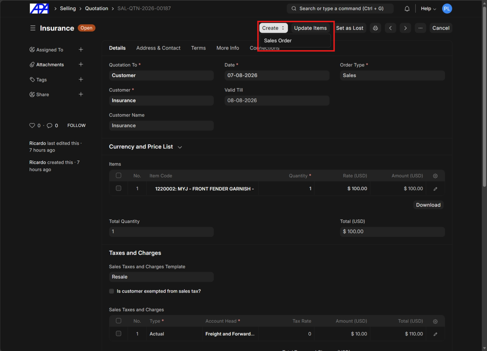
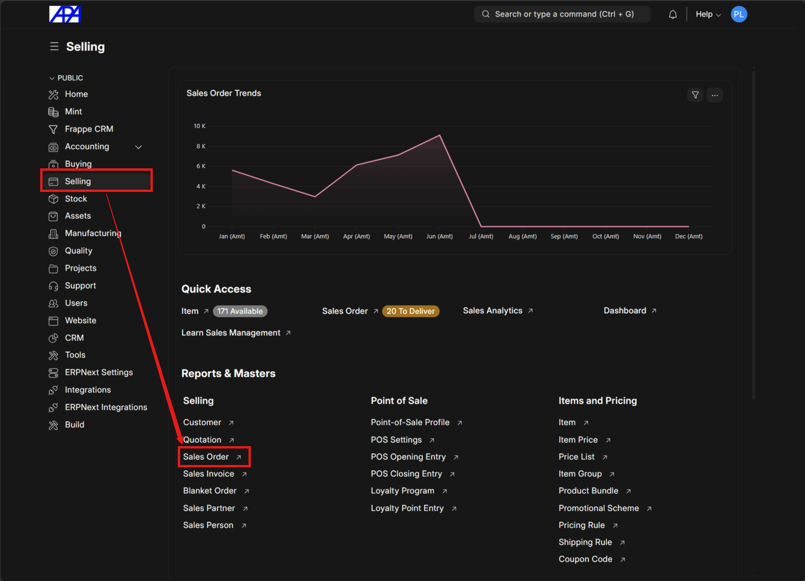
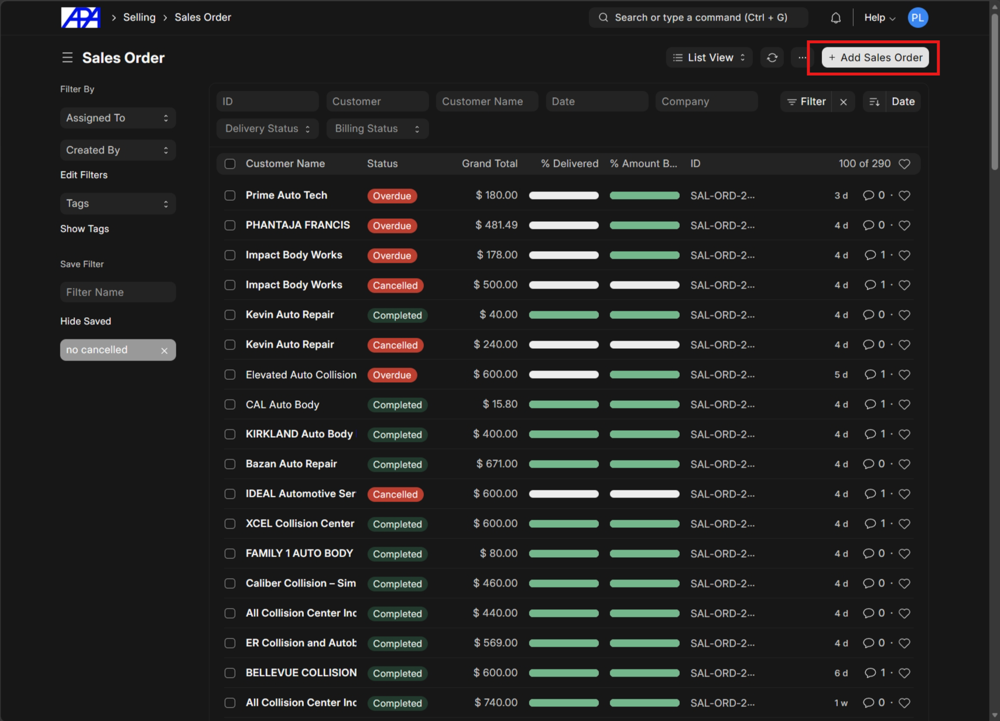
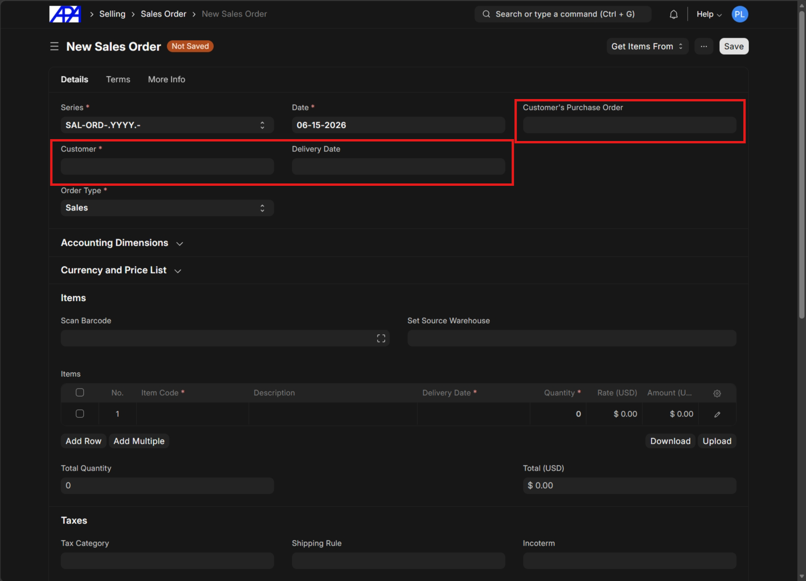

# Create Sales Order

### Step 0: Generate from Quotation (When Available)

Generate the sales order via an approved [Quotation](../quotation/create_quotation.md). Click on the **Create** button in the top right corner and select **Sales Order** from the dropdown menu. Review the details, modify if needed, and proceed.

### Step 1: Navigate to Sales Order List

Navigate to the sales order list and click **"Add Sales Order"**.

### Step 2: Fill in Order Details

Select the **Customer**, set the **Estimated Delivery Date**, and input the customer's **Purchase Order (PO) #** if available.

> [!TIP]
> In addition to customer names, you can use their phone number and address zip code to find their profile.

> [!NOTE]
> Review how to [add a customer](../add-customer/add-customer.md) if the customer is completely new.

### Step 2.5: For Shipping Address Different from Billing Address

You must [add a shipping address](../add-customer/add-customer.md#add-alternate-shipping-address) and associate it with the customer.

### Step 3: Complete the Sales Order

Follow the steps outlined from **Step 3** of the [Create Quotation Guide](../quotation/create_quotation.md#step-3-select-price-list) to complete the sales order.