# System Communications

The proper way to communicate sales documents to customers is as follows:

---

## Quotation

### Step 1: Visit Print Menu

Once submitted, a print button becomes available to acquire an electronic form of the quotation.

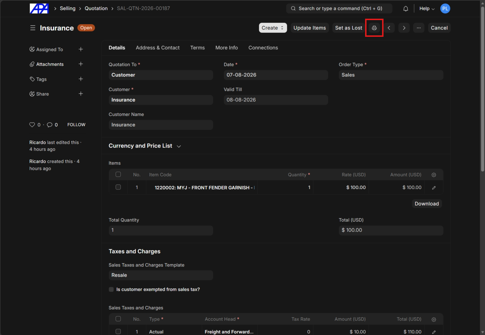

---

### Step 2: Generate PDF

Click the "PDF" button to generate a PDF form of the quotation.

> [!CAUTION]
> Do not click "Print", the reason is that the quotation print format is not optimized for print to PDF, and that method takes more clicks to get the final document.

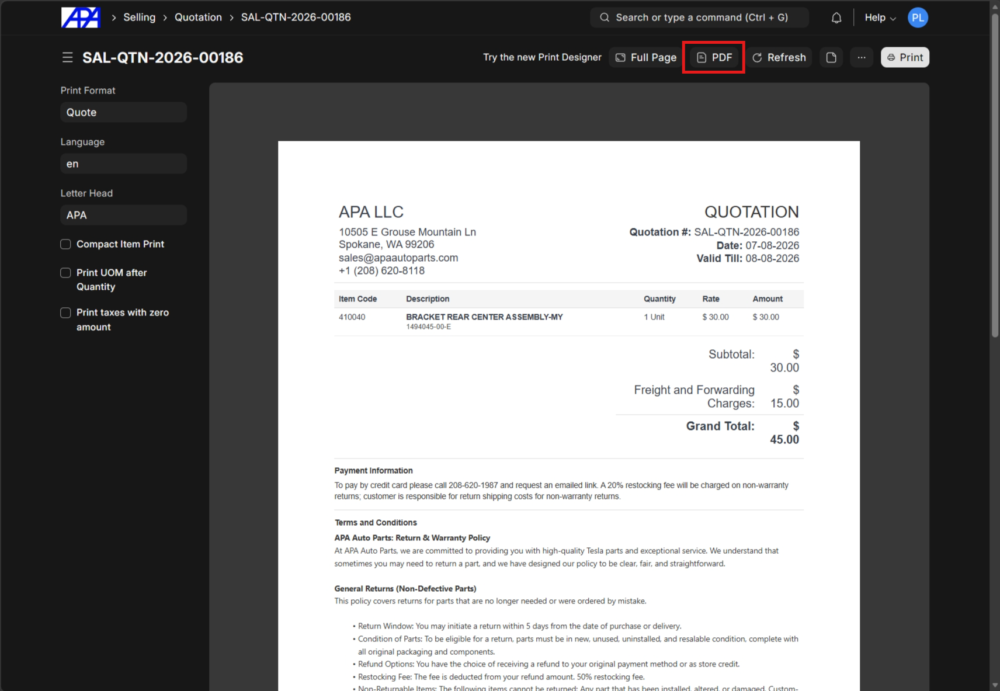

> [!NOTE]
> If you don't see a properly formatted quote document in this menu, select the "Quote" print format if it is not already selected.
>
> 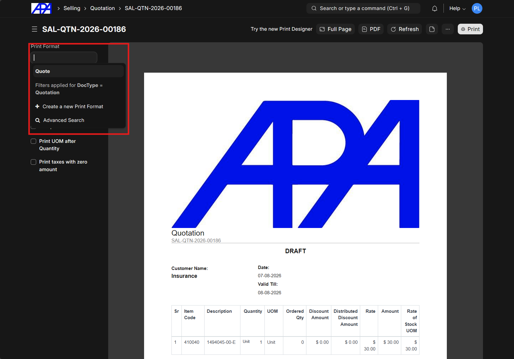

---

### Step 3: Save the PDF Using System Prompts

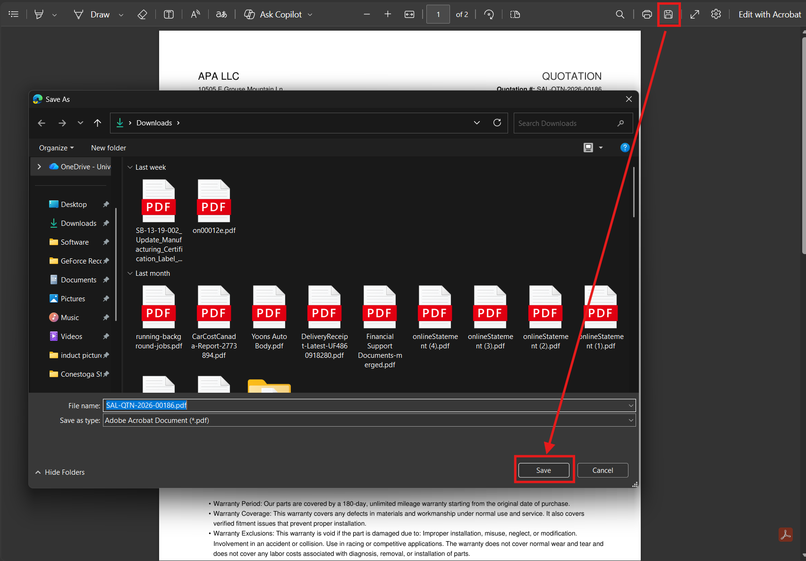

---

### Step 4: Drag and Drop to Email

Using the above method, the file will be available in the downloads list of the browser, allowing you to drag and drop the file into the email.

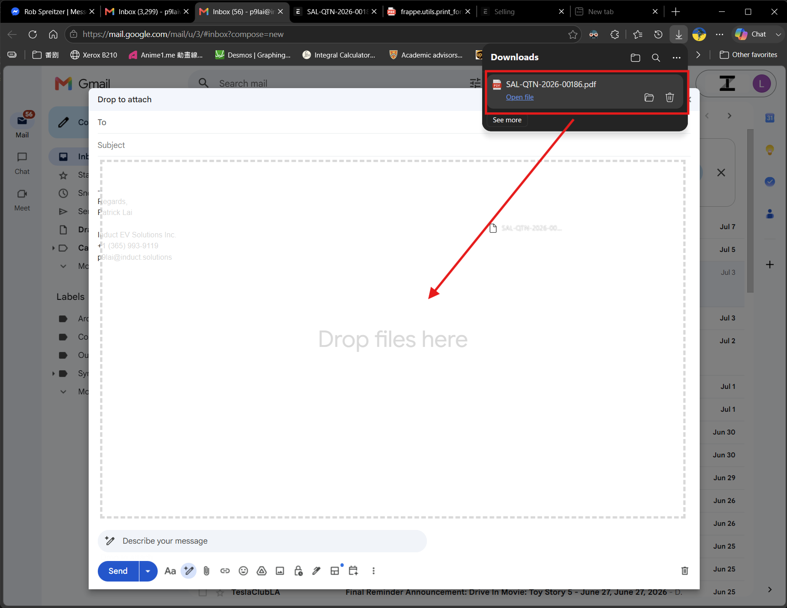

## Sales Order

>[!IMPORTANT]
> Sales orders can be communicated with a payment link or without a payment link.

### With payment link 

#### Step 1: Open Payment Request

In a submitted Sales Order, click on the "Create" button and select "Payment Request".

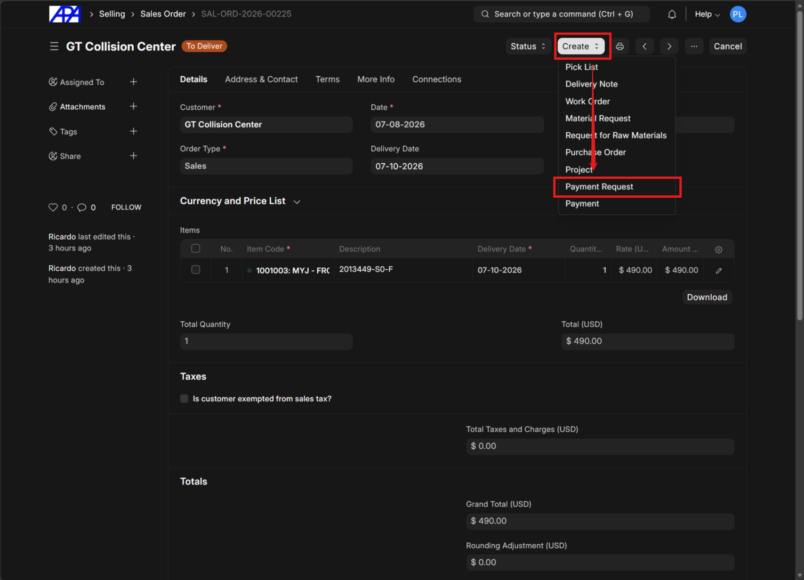

---

#### Step 2: Fill Transaction Details

In the Payment Request form, fill in "Transaction Date" and "Mode of Payment".

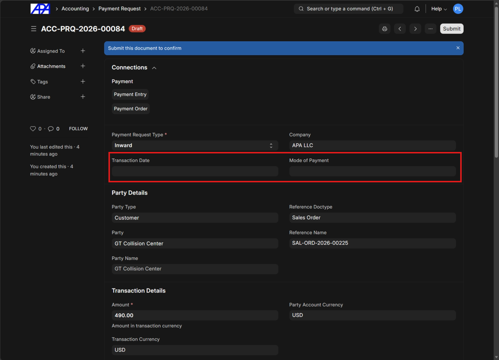

---

#### Step 3: Complete Recipient Message And Payment Details

1. **Set Print Format**: Under the "Recipient Message And Payment Details" section, select **Sales Order** from the **Print Format** dropdown.
2. **Update Subject**: Add `APA | ` to the beginning of the **Subject** line.
3. **Customize Message**: Enter the standard HTML message containing the payment link and required customer instructions:

   ```html
   <p>Hi {{ doc.customer }},</p>
   <p>Thank you for your order! Please see your order summary attached.</p>
   <p>To proceed with order please complete the following:</p>
   <p>1. Attach a photocopy of your resale permit</p>
   <p>2. Complete payment with this link: <a href="{{ payment_url }}"> click here to pay | Powered by Stripe </a></p>
   <p>Your parts will be dispatched once the above item(s) are complete.</p>

   <p>Regards,<br>
   Accounting<br>
   APA Auto Parts</p>
   <p>sales@apaautoparts.com<br>
   +1 (626) 819-0635</p>
   ```

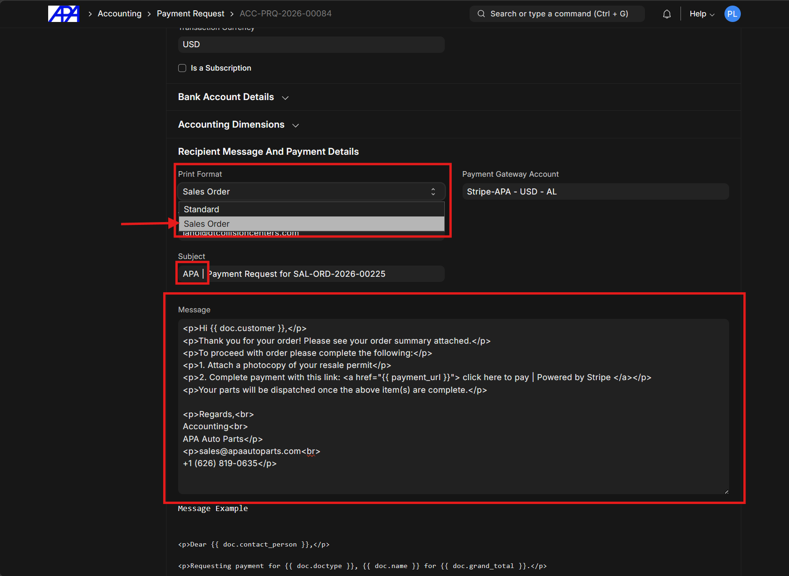

---

#### Step 4: Submit

On submission the customer will receive an email with the payment link and PDF of sales order.

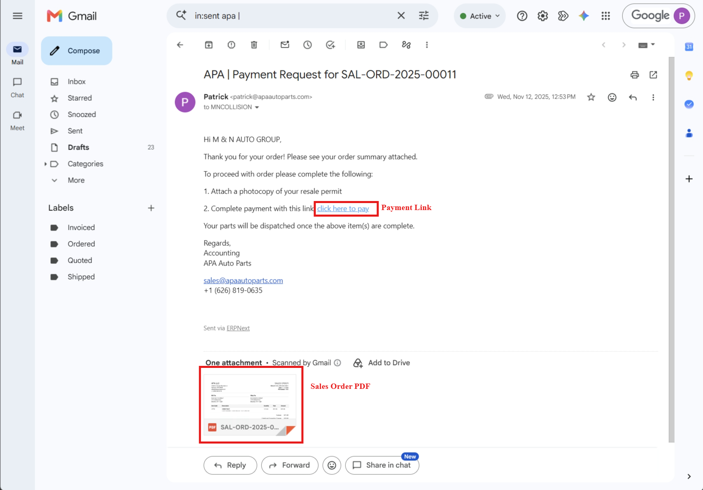

---

#### Step 5: Inform Customer of Payment Link

> [!IMPORTANT]
> Because payment request emails are sent via a different email conversation, you must inform the customer of the payment link within **1 hour** of submission via the original email conversation.

---

### Without payment link (local delivery or pickup)

When a local customer requests payment at delivery, use the same process as [quotation](./system-communications.md#quotation) and communicate via the original email thread.

---

## Sales Invoice

### Step 1: Open Email Menu

From the submitted Sales Invoice, click the three-dot menu (`...`) in the top right corner and select **Email** (or use the shortcut `Ctrl+E`).

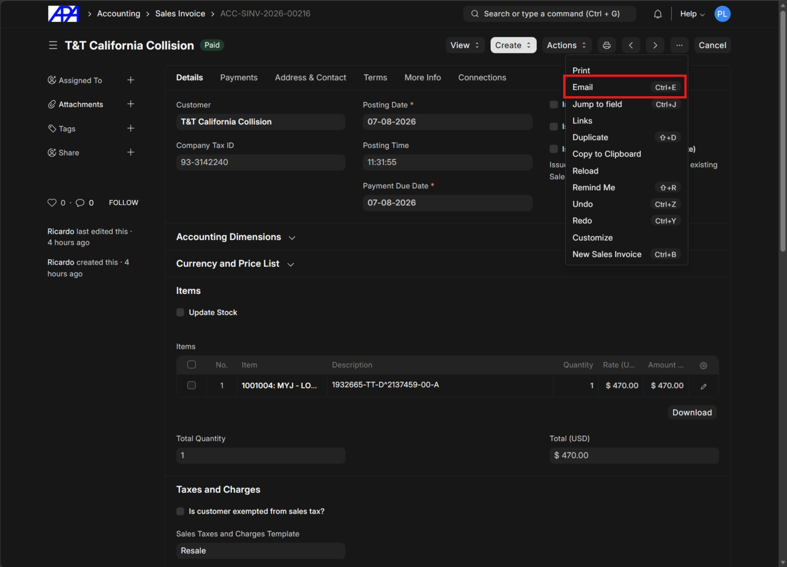

---

### Step 2: Select Email Template

Ensure the recipient's email is correct in the **To** field, then select the appropriate **Email Template** from the dropdown based on the transaction type:
- `Credit Note`
- `Sales Invoice Receipt/Tracking`
- `Sales Invoice Receipt/Tracking LTL`

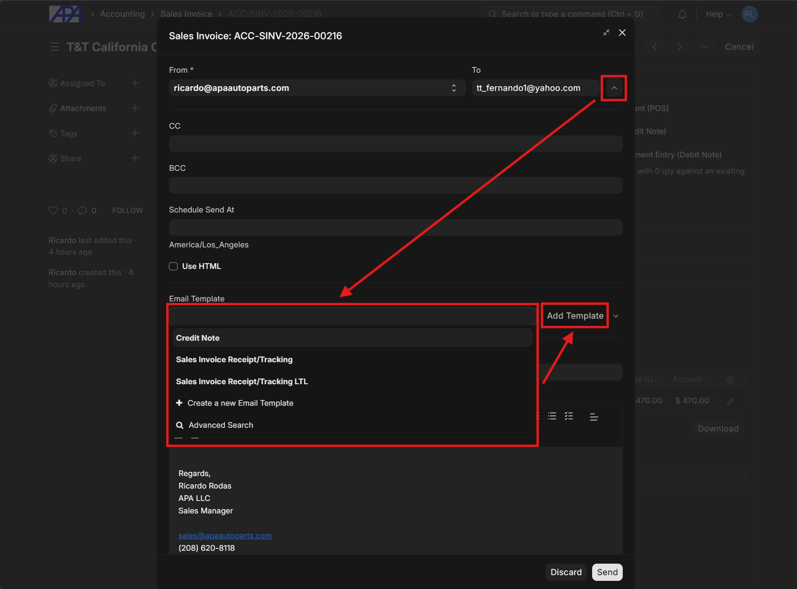

---

### Step 3: Add Tracking or Attachments

Depending on the chosen template and shipping method, complete the email by adding tracking information or required documents:

1. **UPS/FedEx Shipping**
   Update the message body to include the direct tracking link.
   
   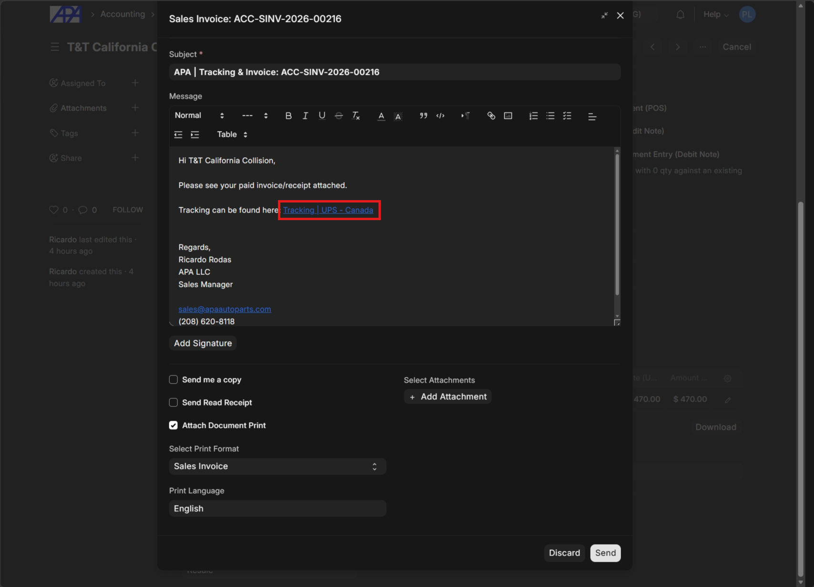

2. **LTL Shipping**
   Click **Add Attachment** under the *Select Attachments* section, then upload the [Bill of Lading (BOL)](../ltl/ltl.md) from your device.

   > [!NOTE]
   > The printer in the office can scan BOL documents directly to your desktop, from where the picture can be attached.

   > [!IMPORTANT]
   > Ensure the BOL attached here is the copy with the tracking label affixed by the pickup driver.
   
   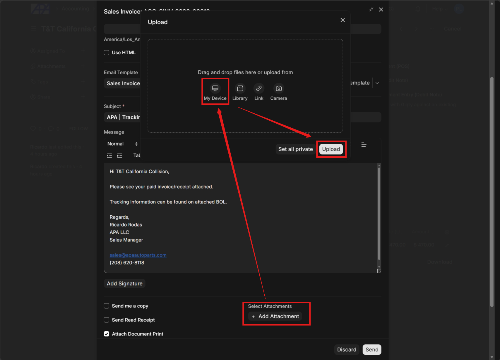

3. **Credit Note (Return)**
   Use the same attachment process as LTL shipping, but attach the return label instead of a BOL.
